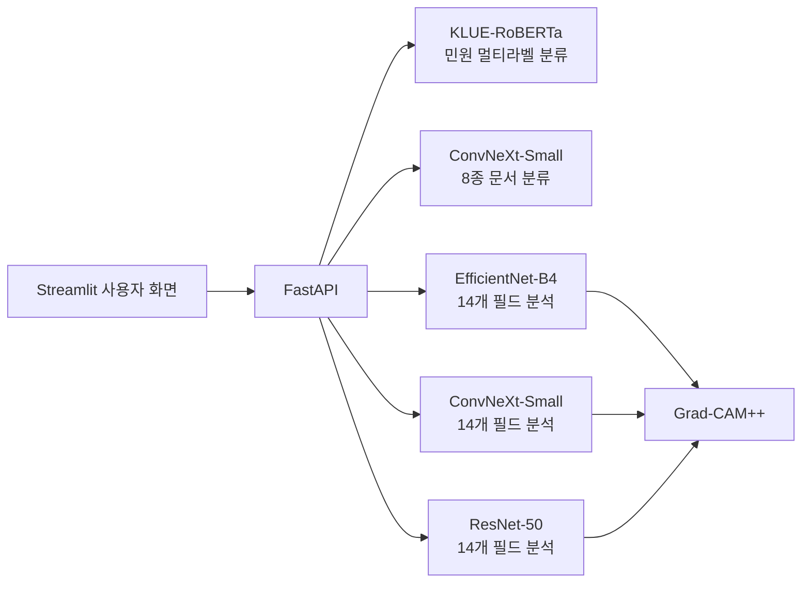

# 지능형 민원처리 프로젝트 면접 질문 및 모범 답안

> 대상: 이 프로젝트를 포트폴리오로 제출한 AI/AI Agent 개발자 지원자  
> 범위: **지능형 민원처리 프로젝트와 직접 관련된 질문만 수록**  
> 답변 방식: 결론 → 프로젝트에서 한 선택 → 근거 → 한계 및 개선 방향

---

## 0. 면접 전에 반드시 지킬 원칙

- 본인이 직접 맡은 범위와 팀원이 맡은 범위를 구분한다.
- 저장소에 구현된 내용, 실험만 한 내용, 앞으로 개선할 내용을 구분한다.
- 높은 성능 수치만 강조하지 말고 데이터 분할과 외부 데이터 검증 여부도 함께 말한다.
- 이 프로젝트는 현재 **여러 AI 모델을 정해진 순서로 연결한 AI 워크플로**이다. LLM이 자율적으로 도구를 선택하는 Agent를 구현했다고 과장하지 않는다.
- 아래 답안은 예시이므로 실제 본인 기여에 맞게 “제가 구현했습니다” 또는 “팀에서 구현했고 저는 ○○를 담당했습니다”로 수정한다.

---

## 1. 프로젝트 소개와 문제 정의

### Q1. 프로젝트를 1분 안에 소개해 주세요.

**모범 답안**

> 지능형 민원처리 시스템은 사용자가 입력한 민원 내용으로 담당 기관, 부서, 민원명, 필요 서류를 추천하고, 업로드한 문서가 필요한 서류와 일치하는지 검증하는 서비스입니다. 민원 텍스트에는 KLUE-RoBERTa 기반 192개 멀티라벨 분류를 적용했고, 문서 이미지는 8개 종류로 분류했습니다. 전입신고서의 경우 14개 필드의 기입 여부를 EfficientNet-B4, ConvNeXt-Small, ResNet-50으로 비교 분석하고 Grad-CAM++로 판단 영역을 시각화했습니다. 학습 모델은 FastAPI 추론 API로 제공하고 Streamlit에서 하나의 사용자 흐름으로 연결했습니다.

### Q2. 어떤 문제를 해결하려고 했나요?

**모범 답안**

> 사용자는 민원 접수 전에 담당 기관과 준비 서류를 찾는 데 시간이 들고, 잘못된 서류나 항목이 누락된 서식을 제출하면 보완 요청을 받게 됩니다. 이 프로젝트는 민원 접수 전에 텍스트로 처리 경로와 필요 서류를 안내하고, 업로드 문서의 종류와 기입 누락을 확인해 탐색 비용과 재접수 가능성을 줄이는 것을 목표로 했습니다.

### Q3. 프로젝트의 핵심 사용 흐름을 설명해 주세요.

**모범 답안**

> 첫째, 사용자가 민원 내용을 입력하면 텍스트 모델이 기관·부서·민원명·필요 서류를 동시에 예측합니다. 둘째, 사용자가 서류 이미지를 올리면 문서 분류 모델이 8개 문서 중 어떤 종류인지 판별해 추천 서류와 비교합니다. 셋째, 전입신고서라면 별도의 멀티라벨 비전 모델이 14개 필드의 기입 여부를 판단하고 Grad-CAM++ 결과와 함께 보여줍니다.

### Q4. 프로젝트에서 AI가 꼭 필요했던 이유는 무엇인가요?

**모범 답안**

> 민원 문장은 같은 의도라도 표현 방식이 다양하고, 하나의 문장에서 기관·민원명·여러 문서를 동시에 찾아야 하므로 단순 키워드 규칙만으로는 확장성과 일반화에 한계가 있습니다. 문서 이미지도 촬영 각도, 밝기, 손글씨와 스캔 품질이 달라 규칙 기반 픽셀 비교가 어렵습니다. 다만 주민등록번호 형식이나 필수 항목 규칙처럼 명확한 부분은 AI보다 코드 기반 검증과 결합하는 것이 적절합니다.

### Q5. 프로젝트에서 본인이 맡은 역할은 무엇인가요?

**모범 답안 예시**

> 저는 [본인 담당 영역]을 맡았습니다. 구체적으로 [데이터 전처리/모델 학습/성능 비교/FastAPI/Streamlit]을 구현했고, [문제 상황]에서 [본인이 한 판단과 행동]을 통해 [측정 가능한 결과]를 만들었습니다. 팀 전체 기능을 제 기여처럼 말하지 않고, 제가 직접 결정하고 검증한 부분을 중심으로 설명드리겠습니다.

> 이 답변은 반드시 실제 담당 업무로 바꿔야 한다.

### Q6. 프로젝트에서 가장 어려웠던 기술적 문제는 무엇이었나요?

**모범 답안**

> 전입신고서는 레이아웃이 고정되어 있어 모델이 필드의 의미보다 특정 위치나 이미지 노이즈를 외울 위험이 컸습니다. 초기 ConvNeXt 실험에서는 적은 데이터로 인해 검증 결과도 흔들렸습니다. 단순 복제로 학습 step을 늘려 보았지만 데이터 다양성이 늘지는 않는다는 한계를 확인했고, 이후 손글씨 데이터 추가, 밝기·대비 증강, 전처리와 하이퍼파라미터 조정을 함께 고려했습니다. 이 경험을 통해 모델 구조보다 데이터 분포와 평가 설계가 먼저라는 점을 배웠습니다.

---

## 2. 시스템 구성과 모델 역할

### Q7. 왜 하나의 모델이 아니라 여러 모델로 나눴나요?

**모범 답안**

> 입력과 출력의 성격이 서로 다르기 때문입니다. 민원 텍스트는 192개 의미 라벨을 예측하는 NLP 문제이고, 문서 종류 판별은 8개 중 하나를 고르는 이미지 다중 클래스 문제이며, 전입신고서 필드 분석은 14개 항목이 동시에 참일 수 있는 이미지 멀티라벨 문제입니다. 각 태스크에 맞는 모델과 손실함수를 사용하고 API 계층에서 결과를 연결하는 방식이 학습과 장애 분리에도 유리했습니다.

### Q8. 시스템 아키텍처를 설명해 주세요.

**모범 답안**

> Streamlit이 사용자 입력과 이미지 업로드를 받고 FastAPI 엔드포인트를 호출합니다. FastAPI는 서버 시작 시 텍스트 모델, 문서 분류 모델, 세 가지 필드 분석 모델을 로드해 재사용합니다. `/classify`는 민원 텍스트, `/classify-document`는 문서 종류, `/efficiNetB4`, `/convNext`, `/resNet50`은 전입신고서 필드를 분석합니다. 결과는 JSON으로 반환하고 Grad-CAM++ 이미지는 base64 PNG로 전달합니다.

### Q9. 각 API 엔드포인트의 역할을 설명해 주세요.

**모범 답안**

> `GET /`은 서버 상태와 제공 기능을 반환합니다. `POST /classify`는 민원 텍스트에서 기관·부서·민원명·문서를 예측합니다. `POST /classify-document`는 업로드 이미지를 8종 문서 중 하나로 분류합니다. 나머지 세 POST 엔드포인트는 동일한 전입신고서 이미지에 대해 모델별 14개 필드 확률과 기입 여부, 대표 Grad-CAM++ 이미지를 반환합니다.

### Q10. 이 시스템에서 모델 간 결과는 어떻게 연결되나요?

**모범 답안**

> 텍스트 모델 결과 중 `문서:` 접두어를 가진 라벨을 필요 서류 목록으로 구성합니다. 문서 분류 API가 업로드 이미지의 문서 클래스를 반환하면 UI에서 필요 서류와 일치 여부를 비교합니다. 문서가 전입신고서라면 사용자가 필드 분석 모델을 호출해 14개 항목의 기입 상태를 확인합니다. 현재 연결은 UI와 API에 정의된 결정적 흐름이며, 모델이 다음 도구를 자율 선택하는 구조는 아닙니다.

---

## 3. 민원 텍스트 멀티라벨 분류

### Q11. 왜 KLUE-RoBERTa를 선택했나요?

**모범 답안**

> 민원 데이터가 한국어이고 문장 의미를 이해해야 하므로 한국어 말뭉치로 사전학습된 KLUE-RoBERTa를 사용했습니다. 사전학습 표현을 활용하면 4,040건 규모의 학습 데이터에서도 처음부터 언어 모델을 학습하는 것보다 효율적으로 fine-tuning할 수 있습니다. 다만 다른 한국어 모델과의 정량 비교 결과가 없다면 “가장 좋았다”가 아니라 “한국어와 데이터 규모를 고려해 선택했다”고 답하겠습니다.

### Q12. 왜 다중 클래스가 아니라 멀티라벨 분류인가요?

**모범 답안**

> 하나의 민원 문장에는 기관, 부서, 민원명과 여러 필요 문서가 동시에 정답으로 존재합니다. 다중 클래스 분류의 softmax는 전체 클래스 중 하나를 선택하지만, 멀티라벨 분류는 각 라벨의 존재 여부를 독립적으로 판단할 수 있습니다. 따라서 192개 출력 logit에 sigmoid를 적용하고 임계값 이상인 라벨을 복수로 반환했습니다.

### Q13. 192개 라벨은 어떻게 구성되어 있나요?

**모범 답안**

> 기관 15개, 부서 30개, 민원명 51개, 필요 문서 96개로 총 192개입니다. 라벨 문자열에는 `기관:`, `부서:`, `민원명:`, `문서:` 접두어를 붙였습니다. 추론 후 `categorize_labels` 함수가 접두어를 기준으로 네 그룹으로 분리해 API 응답과 UI에 표시합니다.

### Q14. `BCEWithLogitsLoss`가 멀티라벨 분류에 적합한 이유는 무엇인가요?

**모범 답안**

> 각 라벨이 독립적인 이진 분류 문제이기 때문에 Binary Cross Entropy가 적합합니다. `BCEWithLogitsLoss`는 sigmoid와 BCE를 한 연산으로 계산해 sigmoid를 먼저 적용하는 방식보다 수치적으로 안정적입니다. 라벨 불균형이 심하면 `pos_weight`나 sampling을 검토할 수 있지만, 가중치가 확률 calibration과 precision-recall에 미치는 영향도 함께 검증해야 합니다.

### Q15. 텍스트 추론 과정을 코드 기준으로 설명해 주세요.

**모범 답안**

> tokenizer가 입력을 최대 128 토큰으로 자르고 `padding="max_length"`로 맞춘 뒤 `input_ids`와 `attention_mask`를 생성합니다. 모델은 192개 logit을 출력하고 `torch.no_grad()` 안에서 sigmoid 확률로 변환합니다. 현재 기본 threshold인 0.4 이상만 선택하고 확률 내림차순으로 정렬한 뒤 접두어별 딕셔너리로 나눕니다.

### Q16. 최대 길이를 128로 설정한 이유와 한계는 무엇인가요?

**모범 답안**

> 일반적인 민원 입력이 비교적 짧다는 가정과 추론 비용을 고려한 설정입니다. 하지만 실제 데이터 길이 분포를 확인하지 않고 정했다면 근거가 약합니다. 토큰 길이의 백분위수를 측정하고 128에서 잘리는 비율과 성능을 확인해야 합니다. 긴 민원이 많다면 256으로 늘리거나 핵심 문장 추출, sliding window 방식을 비교하겠습니다.

### Q17. 텍스트 threshold가 0.4인 이유는 무엇인가요?

**모범 답안**

> 현재 코드는 기본값 0.4를 사용해 0.5보다 더 많은 후보를 반환하도록 되어 있습니다. 필요 서류 누락의 비용이 불필요한 후보 하나를 더 보여주는 비용보다 크다면 recall을 높이려는 방향으로 설명할 수 있습니다. 다만 정확한 선택 근거는 검증 세트의 PR curve와 업무 비용으로 입증해야 하며, 라벨별 빈도가 다르므로 향후에는 그룹별 또는 라벨별 threshold를 최적화하겠습니다.

### Q18. 예측 결과가 하나도 threshold를 넘지 못하면 어떻게 해야 하나요?

**모범 답안**

> 현재 방식이라면 빈 결과가 반환될 수 있습니다. 운영에서는 무조건 top-1을 정답처럼 보여주기보다 낮은 신뢰도임을 표시하고 사용자의 추가 설명을 요청하는 것이 안전합니다. 기관·부서·민원명 그룹별 최소 후보를 참고 정보로 제공하되 임계값 미달임을 구분하거나, 담당자 연결로 fallback할 수 있습니다.

### Q19. 텍스트 데이터의 라벨 불균형은 어떻게 다루겠습니까?

**모범 답안**

> 먼저 라벨별 양성 빈도와 co-occurrence를 확인합니다. 정확도 대신 macro F1, 라벨별 precision-recall, PR-AUC를 봅니다. 희소 라벨은 `pos_weight`, 적절한 oversampling, 데이터 추가를 비교하고, 계층 관계가 명확하면 기관·부서·민원명을 단계적으로 예측하는 구조도 검토할 수 있습니다. 무작정 가중치를 크게 주면 false positive와 확률 왜곡이 커질 수 있어 검증이 필요합니다.

### Q20. 민원 텍스트 모델의 성능을 어떻게 평가해야 하나요?

**모범 답안**

> 192개 전체에 대한 micro/macro precision, recall, F1과 라벨별 PR-AUC를 함께 봐야 합니다. 기관·부서·민원명·문서 그룹별 지표도 분리해야 어느 단계가 약한지 알 수 있습니다. 실제 서비스 관점에서는 필요한 문서를 하나라도 누락한 비율과 잘못된 기관을 상위에 제시한 비율을 중요하게 보겠습니다.

---

## 4. 문서 이미지 분류

### Q21. 문서 이미지 분류는 어떤 문제인가요?

**모범 답안**

> 업로드 이미지 한 장을 여권, 여권신청서, 운전면허증, 임대차계약서, 전입신고서, 주민등록등본, 주민등록증, 확정일자신청서 중 하나로 분류하는 8개 클래스 다중 클래스 문제입니다. 전입신고서 필드 분석처럼 여러 라벨이 동시에 참인 문제가 아니므로 출력에 softmax를 적용해 가장 높은 클래스를 선택합니다.

### Q22. 문서 분류 모델은 무엇인가요?

**모범 답안**

> 현재 `backend/fastapi_main.py`의 실제 구현은 `ConvNeXt-Small`의 마지막 분류 레이어를 8개 클래스로 교체해 사용합니다. 일부 주석과 루트 상태 응답에는 EfficientNet-B0라고 남아 있어 코드와 설명이 불일치합니다. 면접에서는 실제 실행 코드를 기준으로 ConvNeXt-Small이라고 답하고, 주석과 API 메타데이터를 정리해야 할 기술 부채로 인정하겠습니다.

### Q23. 문서 분류 전처리를 설명해 주세요.

**모범 답안**

> 이미지를 RGB로 변환하고 EXIF 방향 정보를 보정한 뒤 224×224로 resize합니다. 이후 tensor로 변환하고 ImageNet 사전학습 통계인 mean `[0.485, 0.456, 0.406]`, std `[0.229, 0.224, 0.225]`로 정규화합니다. 학습과 추론 전처리의 크기, 채널 순서, 정규화가 같아야 합니다.

### Q24. EXIF 방향 보정은 왜 필요한가요?

**모범 답안**

> 스마트폰 사진은 실제 픽셀을 회전시키지 않고 EXIF에 표시 방향만 저장하는 경우가 있습니다. 이를 무시하면 화면에서는 정상으로 보이던 문서가 모델에는 옆으로 누운 이미지로 들어갈 수 있습니다. `ImageOps.exif_transpose`로 방향을 실제 픽셀에 반영해 촬영 기기 차이로 인한 오류를 줄였습니다.

### Q25. 문서 분류의 confidence를 그대로 신뢰해도 되나요?

**모범 답안**

> softmax 최고 확률은 상대적인 모델 확신이지 실제 정답 확률이 아닐 수 있습니다. 분포 밖 문서라도 8개 중 하나에 높은 확률을 줄 수 있습니다. validation에서 ECE나 reliability diagram으로 calibration을 확인하고, temperature scaling과 낮은 신뢰도 거절 기준을 적용하겠습니다. 8종에 없는 문서를 처리하기 위한 unknown/OOD 탐지도 필요합니다.

### Q26. 8종 이외의 문서가 들어오면 어떻게 처리하겠습니까?

**모범 답안**

> 현재 closed-set 분류기는 무조건 8개 중 하나를 선택하므로 잘못된 확정 답변을 할 수 있습니다. 최고 확률과 상위 두 클래스의 margin을 기준으로 불확실성을 표시하고, OOD 데이터로 거절 성능을 평가하겠습니다. 운영에서는 “지원하지 않는 문서” 상태를 두고 사용자에게 다시 촬영하거나 문서 종류를 직접 선택하게 하는 fallback이 필요합니다.

### Q27. 문서 이미지 데이터는 어떻게 분할해야 하나요?

**모범 답안**

> 단순 이미지 무작위 분할보다 원본 문서, 작성자, 촬영 세션, 스캔 장비, 양식 템플릿을 기준으로 group split해야 합니다. 같은 원본에서 만든 회전·밝기 변형본이 train과 test에 나뉘면 데이터 누수가 생깁니다. 증강은 split 이후 train에만 적용하고 perceptual hash로 근접 중복도 검사하겠습니다.

---

## 5. 전입신고서 14개 필드 분석

### Q28. 전입신고서 필드 분석을 멀티라벨로 정의한 이유는 무엇인가요?

**모범 답안**

> 한 문서에서 전입자 성명, 주민등록번호, 연락처, 서명 등 여러 항목이 동시에 기입될 수 있고 각 필드의 상태는 독립적으로 판단해야 합니다. 따라서 14개 logit 각각에 sigmoid와 threshold를 적용했습니다. 하나의 클래스만 선택하는 softmax는 이 문제 정의에 맞지 않습니다.

### Q29. 14개 라벨에는 무엇이 포함되나요?

**모범 답안**

> 전입자 성명·서명도장·주민등록번호·연락처, 이전 주소의 시도·시군구, 현 세대주 성명·서명도장·연락처·주소, 전입 사유 체크, 우편물 서비스 동의 체크, 신청인 성명·서명도장입니다. 이 라벨 목록의 순서는 모델 출력 뉴런의 의미와 직접 연결되므로 학습과 서빙에서 완전히 동일해야 합니다.

### Q30. 학습과 서빙의 라벨 순서가 왜 중요하나요?

**모범 답안**

> state dict는 출력 뉴런의 숫자 인덱스만 저장할 뿐 라벨 이름을 알지 못합니다. 학습에서 두 번째 출력이 주민등록번호였는데 서빙에서 두 번째를 서명도장으로 해석하면 모델 가중치가 정상 로드되어도 결과 의미가 뒤바뀝니다. 현재 저장소는 학습 파일과 `backend/fastapi_main.py`의 일부 라벨 순서가 다르므로 반드시 하나의 JSON을 단일 원천으로 사용하고 모델 artifact에 라벨 순서와 버전을 함께 저장하도록 고쳐야 합니다.

### Q31. `ImageFolder` 대신 Custom Dataset을 사용한 이유는 무엇인가요?

**모범 답안**

> `ImageFolder`는 보통 클래스별 폴더와 이미지당 하나의 클래스 구조를 전제로 합니다. 이 프로젝트는 이미지가 한 폴더에 있고 CSV 한 행에 파일명과 14개 이진 라벨이 들어 있습니다. 따라서 `Dataset`을 상속해 이미지와 14차원 float tensor를 함께 반환하도록 구현했습니다.

### Q32. 왜 `RandomHorizontalFlip`을 사용하지 않았나요?

**모범 답안**

> 전입신고서는 위치 자체가 의미를 갖는 정형 문서입니다. 좌우 반전을 하면 성명, 주소, 서명 필드의 배치가 실제 양식과 달라져 존재하지 않는 데이터를 학습하게 됩니다. 대신 스캐너와 복사기, 촬영 환경의 밝기·대비 차이에 대응하도록 `ColorJitter(brightness=0.2, contrast=0.2)`를 사용했습니다.

### Q33. 모든 이미지를 224×224로 강제 resize하면 어떤 문제가 있나요?

**모범 답안**

> 원본 종횡비가 바뀌고 작은 글씨나 체크 표시가 손실될 수 있습니다. 특히 문서 전체에서 14개 작은 필드를 한 번에 찾는 문제라 224 해상도는 정보 병목이 될 수 있습니다. 비율을 유지한 padding, 더 높은 해상도, 필드별 crop, 객체 탐지 또는 OCR·레이아웃 모델과의 결합을 비교하겠습니다.

### Q34. 필드가 “기입되었다”는 것을 이미지 분류만으로 판단하는 한계는 무엇인가요?

**모범 답안**

> 전체 이미지 멀티라벨 분류는 필드 위치의 시각 패턴으로 기입 여부를 추정하지만, 실제 텍스트가 유효한지까지 확인하지는 못합니다. 빈칸의 얼룩이나 인쇄된 예시를 기입으로 오인할 수 있고, 주민등록번호 형식이 맞는지도 알 수 없습니다. 향후에는 필드 영역 탐지, OCR, 형식 검증을 결합해 존재 여부와 내용 유효성을 분리하겠습니다.

### Q35. 필드별 threshold를 모두 0.5로 쓰는 것이 적절한가요?

**모범 답안**

> 구현은 공통 threshold 0.5를 사용하지만 라벨별 빈도와 난이도가 다르므로 최적이라고 단정할 수 없습니다. 필수 필드 누락을 놓치는 비용이 크다면 recall 중심으로 라벨별 threshold를 정할 수 있습니다. validation PR curve에서 F-beta나 업무 비용을 기준으로 선택하고 test에는 한 번만 적용해야 합니다.

### Q36. `pred_class` 하나를 함께 반환하는 이유와 한계는 무엇인가요?

**모범 답안**

> 코드는 14개 sigmoid 확률 중 가장 큰 인덱스를 `pred_class`로 반환해 Grad-CAM++ target으로 사용합니다. 그러나 멀티라벨 문제에서 argmax 하나가 전체 결과를 대표하지는 않습니다. 사용자가 각 필드의 근거를 보려면 선택한 라벨별 CAM을 생성하거나, 누락으로 판단된 중요 필드를 개별 시각화하는 방식이 더 적절합니다.

---

## 6. EfficientNet-B4, ConvNeXt-Small, ResNet-50 비교

### Q37. 세 모델을 비교한 이유는 무엇인가요?

**모범 답안**

> 동일한 14개 필드 멀티라벨 태스크에서 구조가 다른 CNN 계열 모델의 성능과 학습 특성을 비교하기 위해서입니다. ResNet-50은 안정적인 기준 모델, EfficientNet-B4는 연산량과 해상도·깊이·너비를 함께 확장하는 효율적인 모델, ConvNeXt-Small은 Transformer 설계의 장점을 반영한 현대화된 CNN으로 비교했습니다. 실제 선택에서는 정확도뿐 아니라 추론 시간, 메모리, 데이터 요구량을 함께 봐야 합니다.

### Q38. EfficientNet의 compound scaling을 설명해 주세요.

**모범 답안**

> 네트워크 성능을 키울 때 depth, width, input resolution 중 하나만 늘리는 대신 정해진 계수로 균형 있게 확장하는 방식입니다. EfficientNet-B4는 B0보다 세 요소가 함께 커진 버전입니다. 이 프로젝트에서는 사전학습된 특징을 활용하고 마지막 MBConv 영역과 14개 분류 헤드를 fine-tuning했습니다.

### Q39. ResNet의 residual connection은 왜 중요한가요?

**모범 답안**

> 입력을 몇 개 층 뒤 출력에 더하는 skip connection으로, 깊은 네트워크에서 gradient가 전달되기 쉽게 하고 학습 열화를 줄입니다. ResNet-50에서는 마지막 고수준 특징을 담당하는 `layer4`를 unfreeze하고 `fc`를 2048에서 14 출력으로 교체했습니다.

### Q40. ConvNeXt는 기존 CNN과 무엇이 다른가요?

**모범 답안**

> ConvNeXt는 ResNet 계열을 기반으로 큰 커널 depthwise convolution, stage 구성, LayerNorm 등 Transformer 시대의 설계 선택을 CNN에 반영한 모델입니다. 프로젝트에서는 ConvNeXt-Small의 고수준 stage인 `features[6]`과 마지막 normalization 영역을 학습하고 classifier를 768에서 14 출력으로 교체했습니다.

### Q41. 모델마다 classifier 교체 위치가 다른 이유는 무엇인가요?

**모범 답안**

> torchvision 모델의 내부 구조와 마지막 특징 차원이 다르기 때문입니다. EfficientNet-B4는 `classifier[1]`의 입력이 1792, ConvNeXt-Small은 마지막 Linear의 입력이 768, ResNet-50은 `fc` 입력이 2048입니다. 모델 구조를 확인하지 않고 같은 인덱스로 교체하면 shape mismatch 또는 잘못된 layer 교체가 발생합니다.

### Q42. 전체 레이어를 학습하지 않고 일부만 unfreeze한 이유는 무엇인가요?

**모범 답안**

> 데이터가 비교적 작아 전체 가중치를 한 번에 학습하면 과적합 위험과 연산 비용이 커집니다. ImageNet 사전학습의 일반 시각 특징은 유지하고 문서 태스크와 가까운 고수준 특징과 새 classifier만 조정하려는 전략입니다. 충분한 데이터가 있다면 단계적 unfreezing과 discriminative learning rate를 비교할 수 있습니다.

### Q43. 현재 세 모델 비교가 공정하다고 볼 수 있나요?

**모범 답안**

> 같은 데이터와 기본 탐색 범위를 사용한 점은 비교에 도움이 되지만 완전히 공정하다고 단정하기는 어렵습니다. 모델별 unfreeze 범위, 파라미터 수, 최적 학습률, GPU, seed와 augmentation 영향이 다릅니다. 동일 split과 지표, 반복 실험을 사용하고 모델별 최적 조건과 동일 연산 예산 조건을 각각 보고해야 더 타당합니다.

---

## 7. 학습, 최적화, 평가

### Q44. Optuna로 어떤 값을 탐색했나요?

**모범 답안**

> batch size는 4, 8, 16 중 선택하고 learning rate는 `1e-5`부터 `1e-3` 사이에서 log scale로 탐색했습니다. 각 trial은 5 epoch 동안 validation loss를 평가했고 총 20개 trial을 수행하도록 구성했습니다. 이후 최적 batch size와 learning rate로 최대 20 epoch 재학습했습니다.

### Q45. Optuna의 목적함수로 validation loss를 사용한 이유는 무엇인가요?

**모범 답안**

> 학습에 직접 사용하는 BCE loss를 최소화하면 threshold에 고정되지 않은 확률 출력 전체를 기준으로 탐색할 수 있습니다. 다만 실제 업무 목표가 필수 필드 누락 탐지라면 validation loss가 최종 목적과 완전히 일치하지 않을 수 있습니다. 향후에는 macro F1, mAP 또는 recall 중심의 복합 지표도 비교하겠습니다.

### Q46. Early Stopping은 어떻게 동작하나요?

**모범 답안**

> validation loss가 개선될 때마다 모델을 저장하고 개선되지 않은 epoch가 연속 3번 발생하면 학습을 중단합니다. 마지막 epoch가 아니라 validation loss가 가장 낮았던 시점의 가중치를 test에 사용합니다. 작은 데이터에서 과적합과 불필요한 학습을 줄이는 목적이지만 patience 3 역시 실험 근거로 검증해야 합니다.

### Q47. TensorBoard에는 무엇을 기록했나요?

**모범 답안**

> 배치별 train loss, epoch별 validation loss와 element-wise validation accuracy를 기록했습니다. 이를 통해 학습 수렴, train-validation 간격, 과적합 시점을 확인할 수 있습니다. 더 개선한다면 learning rate, GPU 메모리, 라벨별 precision-recall과 예측 확률 분포도 기록하겠습니다.

### Q48. Element-wise accuracy와 subset accuracy의 차이는 무엇인가요?

**모범 답안**

> Element-wise accuracy는 모든 샘플의 14개 라벨 판단을 각각 세어 맞은 비율입니다. 음성 라벨이 많으면 대부분을 미기입으로 예측해도 높게 나올 수 있습니다. Subset accuracy는 한 문서의 14개 라벨을 전부 맞혀야 정답으로 계산하므로 매우 엄격합니다. 멀티라벨에서는 micro/macro F1, mAP, 라벨별 recall과 함께 봐야 합니다.

### Q49. Micro F1과 Macro F1의 차이는 무엇인가요?

**모범 답안**

> Micro F1은 모든 라벨의 TP, FP, FN을 합쳐 계산하므로 빈도가 높은 라벨의 영향이 큽니다. Macro F1은 라벨별 F1을 동일 가중치로 평균내 희소하거나 어려운 필드의 성능을 드러냅니다. 행정 서식에서는 특정 필수 필드의 누락이 중요하므로 두 지표와 라벨별 recall을 함께 확인해야 합니다.

### Q50. mAP 0.9997을 어떻게 설명하겠습니까?

**모범 답안**

> 실험에서 매우 높은 mAP가 나왔다는 결과는 말할 수 있지만, 운영 일반화를 보장한다고 해석하지는 않겠습니다. 고정된 양식과 유사한 이미지가 많으면 모델이 위치나 템플릿을 학습했을 수 있고, 중복 데이터가 split을 넘었다면 누수 가능성도 있습니다. 원본 문서 단위 group split, 근접 중복 검사, 새로운 촬영 기기와 양식 버전의 외부 테스트로 재검증해야 합니다.

### Q51. 데이터 중복 확장이 왜 근본적인 해결책이 아니었나요?

**모범 답안**

> 동일 이미지를 복제하면 배치 수와 학습 step은 늘지만 새로운 손글씨, 조명, 스캔 품질 같은 정보가 추가되지는 않습니다. 학습 loss를 안정화하는 효과가 있을 수 있지만 일반화 성능은 제한적이고 오히려 특정 샘플 암기를 강화할 수 있습니다. 그래서 실제 다양성을 가진 데이터 추가와 도메인에 맞는 증강이 더 중요하다고 판단했습니다.

### Q52. 재현 가능한 실험을 위해 무엇을 추가해야 하나요?

**모범 답안**

> Python, NumPy, PyTorch와 DataLoader seed를 고정하고 split 파일을 버전 관리해야 합니다. 모델 가중치뿐 아니라 라벨 순서, 전처리, threshold, Optuna best params, 라이브러리 버전, git commit을 artifact 메타데이터에 저장해야 합니다. 서로 다른 GPU에서 완전 동일하지 않을 수 있는 연산도 문서화하고 여러 seed의 평균과 편차를 보고하는 것이 좋습니다.

---

## 8. Grad-CAM++와 설명 가능성

### Q53. Grad-CAM++를 사용한 이유는 무엇인가요?

**모범 답안**

> 모델이 문서의 어느 영역을 보고 특정 필드가 기입됐다고 판단했는지 확인하기 위해 사용했습니다. Grad-CAM 계열은 마지막 convolution feature map과 gradient를 이용해 클래스 관련 영역을 heatmap으로 보여줍니다. Grad-CAM++는 여러 위치에 대상이 나타나는 상황에서 중요 영역을 더 세밀하게 반영할 가능성이 있어 선택했습니다.

### Q54. 모델별 target layer는 어떻게 선택했나요?

**모범 답안**

> ResNet-50은 마지막 convolution stage의 마지막 bottleneck인 `layer4[-1]`을 사용했습니다. EfficientNet-B4와 ConvNeXt-Small은 구현에서 `features[-1]`을 사용합니다. 일반적으로 너무 앞쪽 layer는 저수준 특징만 보이고 너무 뒤쪽은 공간 해상도가 작아지므로, 클래스 의미와 위치 정보가 남아 있는 마지막 convolution 계층을 모델 구조별로 확인해야 합니다.

### Q55. Grad-CAM++ 결과가 모델 판단의 완전한 근거인가요?

**모범 답안**

> 아닙니다. heatmap은 gradient 기반의 사후 설명이며 인과관계를 증명하지 않습니다. target layer와 정규화 방법에 따라 결과가 달라질 수 있고, 보기 좋은 영역을 강조해도 예측이 올바르다는 보장은 없습니다. 오분류 사례 분석과 정량 지표를 우선하고, 필드 bounding box가 있다면 pointing game이나 IoU 같은 localization 평가를 함께 사용하겠습니다.

### Q56. 왜 Grad-CAM++ 이미지를 base64로 반환했나요?

**모범 답안**

> 별도 이미지 파일 저장소나 정적 URL 없이 JSON 응답 하나로 Streamlit에 이미지를 전달하기 위해서입니다. 구현이 단순하고 바로 렌더링할 수 있지만 base64는 원본 binary보다 크고 응답 payload가 증가합니다. 운영에서는 object storage에 저장하고 짧은 수명의 URL을 반환하거나, 별도 이미지 응답을 사용하는 방식을 검토하겠습니다.

---

## 9. FastAPI와 Streamlit 통합

### Q57. 모델을 서버 시작 시 한 번 로드한 이유는 무엇인가요?

**모범 답안**

> 요청마다 모델과 가중치를 로드하면 디스크 I/O와 초기화 때문에 지연 시간이 매우 커지고 메모리도 불안정해집니다. FastAPI lifespan에서 모델과 tokenizer, 라벨, 전처리를 한 번 로드한 뒤 전역 캐시와 `app.state`에서 재사용하도록 했습니다. 운영에서는 모델 로드에 실패하면 readiness를 실패 처리하고 worker마다 모델이 복제되는 메모리도 고려해야 합니다.

### Q58. Pydantic 응답 모델을 사용한 이유는 무엇인가요?

**모범 답안**

> 요청과 응답 형식을 타입으로 명시해 입력 검증과 API 문서화를 자동화하고, 프론트엔드와의 계약을 명확히 하기 위해서입니다. 텍스트 분류는 기관·부서·민원명·문서 딕셔너리와 전체 predictions를, 문서 분류는 클래스·confidence·filename을 반환합니다. 필드 분석 응답도 별도 Pydantic 모델로 통일하면 더 일관된 오류 처리가 가능합니다.

### Q59. 이미지 업로드 API에서 어떤 검증이 필요하나요?

**모범 답안**

> 현재는 PIL로 이미지를 열 수 있는지 확인하지만 운영에서는 Content-Type만 믿지 말고 실제 파일 signature, 최대 크기, 최대 픽셀 수와 허용 확장자를 검증해야 합니다. 압축 폭탄과 과도한 메모리 사용을 막고, 개인정보 문서의 임시 파일과 로그 보존 정책도 필요합니다. 잘못된 입력에는 일관된 4xx 오류 코드와 메시지를 반환해야 합니다.

### Q60. `async def`로 만들면 모델 추론이 자동으로 빨라지나요?

**모범 답안**

> 아닙니다. async는 네트워크나 파일 I/O 대기에는 유리하지만 CPU·GPU 연산을 자동 병렬화하지 않습니다. 큰 추론을 event loop에서 직접 실행하면 다른 요청을 막을 수 있습니다. 동시성 제한, 별도 inference worker, 작업 큐나 dynamic batching을 적용하고 처리량과 p95 지연 시간을 측정해야 합니다.

### Q61. 현재 필드 분석 모델은 GPU를 사용하나요?

**모범 답안**

> 현재 `backend/fastapi_main.py`에서 RoBERTa와 문서 분류 모델은 `.to(device)`를 호출하지만 세 필드 분석 모델과 입력 tensor는 device로 이동하지 않아 사실상 CPU에서 실행됩니다. 학습 코드의 GPU 설정과 서빙 코드는 별개입니다. 모델과 입력을 같은 device로 이동하고, Grad-CAM++의 gradient 메모리 사용과 동시 요청 안전성을 함께 검증해야 합니다.

### Q62. FastAPI 코드에서 개선하고 싶은 부분은 무엇인가요?

**모범 답안**

> 모델 설정, 라벨, 전처리를 중앙화하고 모델별 중복 엔드포인트를 공통 서비스 계층으로 분리하겠습니다. 가중치가 없을 때 일부 모델이 무작위 초기화 상태로 계속 실행되지 않도록 startup을 실패시켜야 합니다. 문서 분류 모델 이름과 API 설명의 불일치도 정리하고, 공통 오류 스키마, 입력 제한, health/readiness, 구조화 로그와 latency metric을 추가하겠습니다.

### Q63. Streamlit을 사용한 이유와 한계는 무엇인가요?

**모범 답안**

> 모델과 API의 전체 사용자 흐름을 빠르게 검증할 수 있는 데모 UI가 필요해 Streamlit을 사용했습니다. Python만으로 텍스트 입력, 이미지 업로드, 표와 heatmap을 빠르게 구성할 수 있다는 장점이 있습니다. 다만 복잡한 상태 관리, 세밀한 UX, 다수 사용자 운영에는 한계가 있어 실제 서비스에서는 별도 프론트엔드와 인증 계층을 고려하겠습니다.

---

## 10. 코드 리뷰에서 나올 수 있는 날카로운 질문

### Q64. 모델 파일이 없을 때 현재 코드는 어떻게 동작하나요?

**모범 답안**

> EfficientNet-B4는 가중치 로드가 필수라 파일이 없으면 startup에서 실패하지만, 일부 ConvNeXt·ResNet 로더는 `model_path.exists()`일 때만 로드하고 아니면 무작위 초기화 모델을 반환합니다. 이는 서버는 정상처럼 보이지만 잘못된 예측을 내는 위험한 동작입니다. 모든 필수 artifact의 존재, checksum, 라벨 버전을 startup에서 검증하고 하나라도 맞지 않으면 readiness를 실패시키겠습니다.

### Q65. 루트 API 설명과 실제 문서 분류 모델이 왜 다른가요?

**모범 답안**

> 모델을 EfficientNet-B0에서 ConvNeXt-Small로 변경한 뒤 일부 docstring과 상태 응답을 함께 갱신하지 못한 기술 부채입니다. 실제 `get_doc_model`은 ConvNeXt-Small을 생성합니다. 모델 이름을 코드 여러 곳에 문자열로 복제하지 않고 중앙 설정과 모델 registry에서 가져오도록 바꾸고 API 테스트로 메타데이터와 실제 모델의 일치를 검증하겠습니다.

### Q66. 추론 요청마다 모든 파라미터의 `requires_grad=True`를 설정하는 이유는 무엇인가요?

**모범 답안**

> Grad-CAM++ 계산에 gradient가 필요해 설정한 것으로 보이지만, 매 요청마다 전체 파라미터를 변경하는 것은 불필요하고 메모리 비용과 동시성 문제를 키울 수 있습니다. 일반 예측과 설명 생성 경로를 분리하고, CAM 라이브러리에 필요한 최소 gradient 범위를 확인하겠습니다. 일반 추론은 `inference_mode` 또는 `no_grad`로 실행하고 사용자가 설명을 요청할 때만 CAM을 계산하는 것이 효율적입니다.

### Q67. 학습 파일마다 GPU가 `cuda:0`, `cuda:1`로 하드코딩된 문제는 없나요?

**모범 답안**

> 실행 환경에 해당 GPU 인덱스가 없으면 실패할 수 있고 재현성과 배포성이 떨어집니다. CLI 인자나 환경 설정으로 device를 주입하고 기본값은 사용 가능한 장치를 안전하게 선택하도록 바꾸겠습니다. 실험 로그에는 실제 GPU 모델과 device, CUDA·PyTorch 버전을 기록해야 합니다.

### Q68. 학습 스크립트를 import하면 바로 학습이 시작되는 구조의 문제는 무엇인가요?

**모범 답안**

> dataset 생성, Optuna 탐색, 학습이 모듈 최상위에서 실행되면 함수를 테스트하거나 다른 코드에서 import하기 어렵습니다. 설정, dataset, train, evaluate를 함수와 클래스로 분리하고 `if __name__ == "__main__":` 아래 CLI entry point를 두겠습니다. 이렇게 해야 단위 테스트, 재사용, 실험 설정 관리가 쉬워집니다.

---

## 11. 운영·보안·개선 방향

### Q69. 실제 행정 서비스에 적용하려면 무엇이 더 필요한가요?

**모범 답안**

> 새로운 양식과 촬영 환경의 외부 검증, 모델·데이터 버전 관리, confidence calibration과 낮은 신뢰도 fallback이 필요합니다. 주민등록번호와 주소가 포함되므로 전송·저장 암호화, 접근 통제, 로그 마스킹, 보존 기간과 삭제 정책이 필수입니다. AI가 최종 행정 판단을 내리기보다 담당자 검토를 돕고 사용자가 오류를 수정하거나 이의를 제기할 경로도 제공해야 합니다.

### Q70. 개인정보 문서를 어떻게 안전하게 처리하겠습니까?

**모범 답안**

> 수집을 최소화하고 추론 후 원본을 즉시 폐기하는 것을 기본으로 하겠습니다. 전송 구간 암호화, 저장이 필요할 경우 별도 암호화와 짧은 TTL, 사용자·업무별 접근 권한, 감사 로그를 적용합니다. 이미지 원문이나 주민등록번호가 애플리케이션 로그, 오류 추적, 학습 데이터에 무단으로 남지 않도록 마스킹과 동의 절차를 둡니다.

### Q71. 운영 중 데이터 drift를 어떻게 감지하나요?

**모범 답안**

> 입력 이미지의 해상도, 밝기, 회전, 기기, 클래스 분포와 예측 confidence 분포를 학습 시점과 비교합니다. 라벨을 확보할 수 있는 표본은 라벨별 성능을 지속 측정하고 낮은 신뢰도·재업로드·담당자 수정 비율을 proxy 지표로 봅니다. 양식 개정이나 새로운 문서 종류가 감지되면 재학습 전에 별도 버전으로 데이터를 수집하고 평가합니다.

### Q72. 추론 성능과 비용을 어떻게 개선하겠습니까?

**모범 답안**

> 먼저 모델별 p50/p95 latency, 메모리와 처리량을 측정합니다. 세 필드 모델을 사용자에게 모두 실행하기보다 검증으로 선택한 하나를 기본 모델로 사용하고 비교 기능은 관리자나 실험 환경으로 제한하겠습니다. Grad-CAM++는 요청 시에만 계산하고, GPU inference worker와 batching, mixed precision, 필요하면 양자화를 품질 저하와 함께 비교하겠습니다.

### Q73. 이 프로젝트의 다음 모델링 개선 순서는 무엇인가요?

**모범 답안**

> 첫째, 라벨 순서와 데이터 누수를 먼저 검증해 평가 신뢰성을 확보하겠습니다. 둘째, 외부 데이터와 양식 버전별 성능을 측정하고 라벨별 threshold를 조정하겠습니다. 셋째, 전체 이미지 멀티라벨 분류를 필드 검출·OCR·형식 검증 파이프라인으로 확장하겠습니다. 마지막으로 latency와 보안 요구를 충족한 모델만 API에 배포하겠습니다.

---

## 12. AI Agent 직무와 프로젝트를 연결하는 질문

### Q74. 이 프로젝트가 AI Agent 개발과 어떤 관련이 있나요?

**모범 답안**

> 현재 구현은 완전한 Agent가 아니라 텍스트 분류, 문서 분류, 필드 검증이라는 전문 모델을 API로 연결한 AI 워크플로입니다. 다만 서로 다른 모델의 입출력 계약을 정의하고, 한 모델의 결과를 다음 사용자 행동과 연결하며, 모델 캐싱·오류 처리·설명 가능성을 고려한 경험은 Agent의 도구 계층 설계와 연결됩니다. Agent 직무에서는 이 모델들을 결정적 도구로 사용하고 LLM은 모호한 의도 파악과 도구 선택에만 제한적으로 활용할 수 있습니다.

### Q75. 이 프로젝트를 Agent 형태로 확장한다면 어떻게 하겠습니까?

**모범 답안**

> 기존 기능을 `민원 분류`, `행정 규정 검색`, `문서 종류 판별`, `필드 누락 검증` 도구로 분리하겠습니다. 오케스트레이터는 사용자의 민원이 모호하면 추가 질문을 하고, 민원 종류가 정해지면 필요한 서류를 조회한 뒤 업로드 문서에 맞는 검증 도구를 선택합니다. 낮은 신뢰도, 개인정보 외부 전송, 행정 규정 충돌은 자동 처리하지 않고 담당자에게 이관하며, 도구 결과와 승인 상태를 구조화해 저장하겠습니다.

### Q76. LLM에게 맡기면 안 되는 부분은 무엇인가요?

**모범 답안**

> 주민등록번호 형식, 파일 크기, 접근 권한, 필수 서류 규칙처럼 결정적으로 검증할 수 있는 것은 코드에 둡니다. 비전 모델이 반환한 확률과 원본 결과를 LLM이 임의로 바꾸게 하지 않습니다. 최종 행정 처분이나 민감정보 전송은 사용자 또는 담당자의 승인을 받습니다. LLM은 자연어 이해, 설명과 제한된 도구 선택에 집중시키겠습니다.

### Q77. 기존 모델을 Agent 도구로 만들 때 어떤 스키마를 사용하겠습니까?

**모범 답안**

> 도구마다 역할을 하나로 제한하고 Pydantic 또는 JSON Schema로 입출력을 정의하겠습니다. 예를 들어 문서 분류 도구는 이미지 참조 ID를 입력받아 `document_class`, `confidence`, `model_version`, `status`를 반환합니다. 필드 검증 도구는 14개 필드별 확률과 threshold, 설명 이미지 참조를 반환합니다. 모델 오류와 사용자 입력 오류, 재시도 가능 여부도 구조화해 오케스트레이터가 안전하게 다음 행동을 고르게 하겠습니다.

### Q78. Agent가 잘못된 민원 경로를 안내하지 않게 하려면 어떻게 평가하나요?

**모범 답안**

> 전체 과업 성공률만 보지 않고 민원 분류 정확도, 올바른 도구 선택률, 필요 문서 누락률, 문서 일치 판정률, 필드 누락 recall을 단계별로 측정합니다. 실제 민원 시나리오를 고정 평가 세트로 만들고 규정에 없는 답을 생성했는지, 낮은 신뢰도에서 추가 질문이나 담당자 이관을 했는지도 평가합니다.

---

## 13. 협업과 회고 질문

### Q79. 실패한 시도에서 무엇을 배웠나요?

**모범 답안**

> ConvNeXt 성능을 안정화하려고 같은 데이터를 복제했지만, 학습 횟수 증가와 정보 다양성 증가는 다르다는 것을 확인했습니다. 이후 모델 구조만 바꾸기보다 데이터 중복, 분할, 손글씨와 촬영 환경을 먼저 확인하는 습관을 갖게 됐습니다. 지금 다시 한다면 실험 전에 가설, 변경 변수, 성공 지표를 정하고 한 번에 하나의 요인만 비교하겠습니다.

### Q80. 프로젝트를 다시 시작한다면 무엇을 다르게 하겠습니까?

**모범 답안**

> 먼저 단일 라벨 정의 파일과 group split을 만들고 데이터 품질 검사를 자동화하겠습니다. 빠른 baseline을 세운 뒤 모델별 동일 평가 프로토콜을 적용하고, 실험 설정과 artifact를 버전 관리하겠습니다. 서비스 단계에서는 모델 이름과 전처리, 라벨 버전을 registry에서 읽도록 하고, 개인정보 보호와 낮은 신뢰도 fallback을 초기 설계부터 포함하겠습니다.

### Q81. 팀에서 기술 선택 의견이 달랐다면 어떻게 결정했나요?

**모범 답안 예시**

> 먼저 정확도, 추론 시간, GPU 메모리, 일정 중 무엇을 우선할지 합의했습니다. 세 모델을 같은 데이터와 기본 지표로 비교하고 결과를 공유해 선택 근거를 만들었습니다. 되돌릴 수 있는 모델 선택은 실험으로 빠르게 결정하고, 라벨 스키마와 API 계약처럼 변경 비용이 큰 부분은 팀 리뷰와 문서화를 거쳤습니다.

### Q82. 이 프로젝트에서 가장 크게 성장한 부분은 무엇인가요?

**모범 답안**

> 모델 학습 수치만 높이는 것과 신뢰할 수 있는 서비스를 만드는 것이 다르다는 점을 배웠습니다. 데이터 분할, 라벨 순서, 학습·추론 전처리 일치, confidence 해석, API 오류 처리 중 하나만 어긋나도 좋은 모델이 잘못 동작할 수 있습니다. 그래서 이제는 모델, 데이터, 서빙 코드를 하나의 시스템으로 보고 검증하려고 합니다.

---

## 14. 프로젝트 수치·구현 빠른 확인표

| 항목 | 답변 |
| --- | --- |
| 프로젝트 목적 | 민원 처리 경로·필요 서류 안내와 제출 문서 사전 검증 |
| 텍스트 모델 | KLUE-RoBERTa 기반 멀티라벨 분류 |
| 텍스트 라벨 | 기관 15 + 부서 30 + 민원명 51 + 문서 96 = 192개 |
| 텍스트 데이터 | Train 4,040 / Validation 1,010 / Test 1,270 |
| 텍스트 최대 길이 | 128 tokens |
| 텍스트 추론 threshold | 0.4 |
| 문서 분류 | 실제 백엔드 코드 기준 ConvNeXt-Small, 8개 클래스 |
| 문서 종류 | 여권, 여권신청서, 운전면허증, 임대차계약서, 전입신고서, 주민등록등본, 주민등록증, 확정일자신청서 |
| 필드 분석 | 전입신고서의 14개 필드 멀티라벨 분류 |
| 필드 threshold | 0.5 |
| 필드 비교 모델 | EfficientNet-B4, ConvNeXt-Small, ResNet-50 |
| 손실함수 | `BCEWithLogitsLoss` |
| 입력 크기 | 224×224 RGB |
| 학습 증강 | 밝기·대비 ColorJitter, 좌우 반전 제외 |
| Optuna | batch size 4/8/16, lr 1e-5~1e-3, 20 trials |
| Early Stopping | validation loss 기준, patience 3 |
| 시각화 | Grad-CAM++ |
| API | FastAPI |
| 데모 UI | Streamlit |

---

## 15. 면접 직전 체크리스트

- [ ] 1분 프로젝트 소개를 외우지 않고 자연스럽게 말할 수 있다.
- [ ] 본인의 실제 담당 범위와 팀 기여를 구분할 수 있다.
- [ ] 멀티라벨과 다중 클래스의 차이를 프로젝트 예시로 설명할 수 있다.
- [ ] sigmoid, softmax, `BCEWithLogitsLoss`를 설명할 수 있다.
- [ ] 192개 텍스트 라벨과 14개 필드 라벨의 구성을 알고 있다.
- [ ] 세 비전 모델의 classifier와 fine-tuning 범위 차이를 설명할 수 있다.
- [ ] element-wise accuracy, subset accuracy, micro/macro F1, mAP의 차이를 설명할 수 있다.
- [ ] mAP 0.9997을 과장하지 않고 누수와 외부 검증 한계를 말할 수 있다.
- [ ] 라벨 순서, 모델 명칭, device 처리 등 현재 코드의 개선점을 설명할 수 있다.
- [ ] 이 프로젝트가 현재 완전한 Agent가 아니라는 점을 정직하게 말할 수 있다.
- [ ] Agent로 확장할 때 기존 모델을 어떤 도구로 만들지 설명할 수 있다.
- [ ] 개인정보 문서를 처리할 때 필요한 보안 조치를 설명할 수 있다.

---

## 16. 최종 마무리 답변

> 이 프로젝트를 통해 한국어 민원 분류, 문서 이미지 분류, 전입신고서 필드 분석을 각각 모델링하고 FastAPI와 Streamlit으로 하나의 서비스 흐름에 통합했습니다. 특히 데이터 다양성, 멀티라벨 지표, 학습과 서빙의 일관성, 설명 가능성과 같은 실무 문제를 경험했습니다. 현재 구조를 Agent라고 과장하지는 않지만, 기존 모델을 신뢰 가능한 도구로 만들고 LLM이 필요한 도구만 선택하도록 확장할 수 있으며, 그 과정에서도 정확도뿐 아니라 평가·오류 처리·개인정보 보호를 함께 설계하겠습니다.
