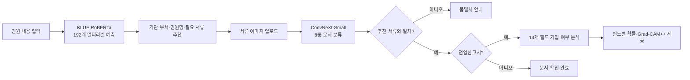
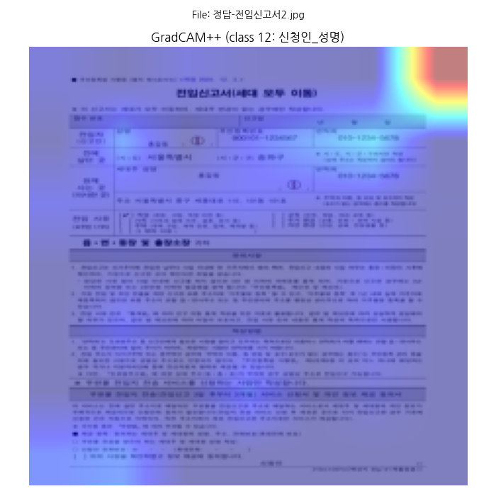
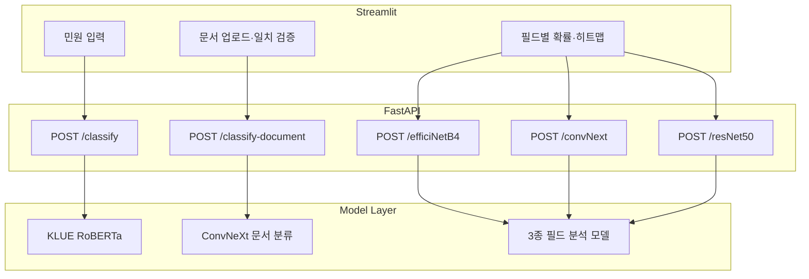

# 지능형 민원처리 시스템

> 민원 내용 분석부터 제출 서류 확인, 전입신고서 기입 누락 탐지까지 하나의 흐름으로 연결한 AI 기반 민원 접수 보조 서비스

[GitHub 저장소](https://github.com/fdt15ss/PJ02-DEEP)

## 프로젝트 정보

| 항목 | 내용 |
| --- | --- |
| 기간 | 2026.03 |
| 형태 | 4인 팀 프로젝트 |
| 개발 범위 | AI 모델 학습·평가, FastAPI 추론 API, Streamlit 데모 |
| 개인 담당 | 행정 서식 데이터 전처리, ConvNeXt-Small 기반 14개 필드 분류, Optuna 최적화, Grad-CAM 분석, 모델 테스트 UI 및 실험 문서화 |
| 현재 상태 | 로컬 환경에서 실행 가능한 프로토타입 |

> 아래에서 “전체 시스템”은 팀이 공동 구현한 범위를, “개인 담당”은 직접 수행한 작업을 구분해 설명합니다.

## 핵심 성과

- 민원 텍스트의 **192개 라벨 예측**, 제출 문서의 **8종 분류**, 전입신고서의 **14개 필드 기입 여부 판별**을 하나의 사용자 흐름으로 통합했습니다.
- 개인 담당 모델인 ConvNeXt-Small의 보유 데이터 분할 평가에서 **mAP 0.9870 → 0.9997**로 1.27%p 개선했습니다.
- PDF 첫 페이지 추출, 300 DPI 이미지 변환, 데이터 분할, 라벨 CSV 생성부터 학습·평가·시각화까지 재사용 가능한 파이프라인을 구성했습니다.
- 높은 mAP만으로 모델의 판단 근거까지 신뢰할 수 없음을 Grad-CAM 분석으로 확인하고, 레이아웃 편향과 데이터 누수 가능성을 후속 과제로 도출했습니다.

## 해결하려는 문제

민원인은 접수 전에 다음 정보를 각각 찾아야 합니다.

1. 어느 기관과 부서가 담당하는가?
2. 어떤 민원으로 접수하고 어떤 서류를 준비해야 하는가?
3. 준비한 문서가 요구 서류와 일치하는가?
4. 전입신고서의 필수 항목을 빠뜨리지 않았는가?

이 탐색과 확인 과정이 분리되어 있으면 접수 이후 서류 보완 요청이 반복될 수 있습니다. 이 프로젝트는 텍스트 분류와 문서 이미지 분석을 연결해 접수 전 확인 비용을 줄이는 것을 목표로 했습니다.

## 전체 서비스 흐름



## 개인 담당

### 1. 행정 서식 데이터 파이프라인

- 여러 페이지 PDF에서 분석 대상인 첫 페이지만 분리했습니다.
- PDF를 300 DPI JPG로 변환하고 파일명과 라벨 폴더 구조를 정리했습니다.
- Train/Validation/Test를 물리적으로 분리하고, 이미지별 14개 이진 라벨을 담은 CSV를 생성했습니다.
- 멀티라벨 데이터 구조에 맞춰 `ImageFolder` 대신 CSV를 읽는 커스텀 `Dataset`을 구현했습니다.

관련 자료:

- [전입신고서 데이터셋 가이드](document_forms_source/document_form_dataset_guide_v3.md)
- [ConvNeXt 실험 보고서](document_forms_source/readme.md)

### 2. ConvNeXt-Small 기반 필드 누락 분석

전입신고서의 14개 항목은 서로 배타적인 클래스가 아닙니다. 한 이미지에서 여러 항목이 동시에 기입되거나 비어 있을 수 있으므로, 단일 클래스 분류가 아닌 **다중 라벨 분류**로 정의했습니다.

| 설계 항목 | 적용 내용 | 선택 이유 |
| --- | --- | --- |
| Backbone | ImageNet 사전학습 ConvNeXt-Small | 표, 필드 위치, 서명 영역 등 문서의 구조적 패턴 학습 |
| Classifier | `Linear(768, 14)` | 사전학습 출력층을 14개 필드에 맞게 교체 |
| Loss | `BCEWithLogitsLoss` | 각 필드의 기입 여부를 독립적인 이진 문제로 학습 |
| Fine-tuning | 후반 feature stage 중심 | 작은 데이터셋에서 전체 파라미터 학습에 따른 과적합 완화 |
| Augmentation | 밝기·대비 변화 | 스캔·촬영 환경 차이 반영 |
| 제외한 증강 | 좌우 반전 | 고정된 서식의 필드 위치가 뒤집히는 비현실적 데이터 방지 |
| Optimization | Optuna로 batch size와 learning rate 탐색 | 수동 튜닝 편향과 반복 비용 감소 |
| Regularization | Early Stopping, patience 3 | 검증 손실이 악화되는 구간의 과적합 제한 |

학습 파이프라인은 [convNext/convNext_main.py](convNext/convNext_main.py), 설계 근거는 [convNext/workflow.md](convNext/workflow.md)에서 확인할 수 있습니다.

### 3. 모델 평가와 설명 가능성 분석

14개 필드마다 sigmoid 확률을 계산하고 임계값을 적용해 기입 여부를 판단했습니다. 정답 비율만 보는 Accuracy의 한계를 보완하기 위해 필드별 AP를 계산한 뒤 평균한 mAP를 핵심 지표로 사용했습니다.

| 실험 | 변경 내용 | 결과 |
| --- | --- | ---: |
| 1차 | ImageNet 기본 전처리 | Accuracy 0.9598, mAP 0.9870 |
| 2차 | 손글씨 데이터 포함, 약 4,000장 규모로 확장 | mAP 0.9988 |
| 3차 | Optuna 기반 batch size·learning rate 탐색 | **mAP 0.9997** |

3차 실험의 최적 탐색값은 batch size 6, learning rate 약 0.000962였습니다. 1차 대비 mAP는 1.27%p, 2차 대비 0.09%p 향상됐습니다.

> 위 수치는 프로젝트 내부 데이터 분할에서 측정한 결과입니다. 고정 서식의 유사 이미지와 데이터 확장 과정이 지표를 높였을 가능성이 있으므로, 실제 행정 문서 전체에 대한 일반화 성능으로 해석하지 않았습니다.

Grad-CAM++로 모델이 주목한 영역도 확인했습니다.



시각화에서는 일부 예측이 실제 필드가 아닌 문서 가장자리나 고정 레이아웃을 참고하는 현상이 관찰됐습니다. 이는 **높은 mAP와 설명의 타당성이 같은 의미가 아님**을 보여줬습니다. 따라서 Grad-CAM은 신뢰성을 보장하는 장치가 아니라, 위치 편향과 잘못된 단서를 발견하기 위한 진단 도구로 사용했습니다.

### 4. 모델 테스트 UI와 실험 문서화

- ConvNeXt 체크포인트를 선택해 결과를 비교할 수 있는 Streamlit 모델 테스터를 구성했습니다.
- 필드별 확률과 Grad-CAM 결과를 화면에서 확인하도록 연결했습니다.
- Optuna study와 모델별 실험 조건, 실행 방법, 평가 지표 정의를 문서화했습니다.

관련 코드는 [streamlit/model_tester_convnext.py](streamlit/model_tester_convnext.py)에서 확인할 수 있습니다.

## 팀 공동 구현 범위

### 민원 텍스트 분류

KLUE RoBERTa를 이용해 하나의 민원 문장에서 기관, 부서, 민원명, 필요 문서를 동시에 예측합니다. 임계값 이상의 라벨을 선택한 뒤 `기관:`, `부서:`, `민원명:`, `문서:` 접두어를 기준으로 화면에 구분해 표시합니다.

| 데이터 | 건수 |
| --- | ---: |
| Train | 4,040 |
| Validation | 1,010 |
| Test | 1,270 |
| 전체 라벨 | 192 |

라벨은 기관 15개, 부서 30개, 민원명 51개, 문서 96개로 구성됩니다.

### 문서 종류 분류

ConvNeXt-Small로 업로드 문서를 다음 8종으로 분류하고, 민원 텍스트 모델이 추천한 서류와 일치하는지 확인합니다.

- 여권
- 여권신청서
- 운전면허증
- 임대차계약서
- 전입신고서
- 주민등록등본
- 주민등록증
- 확정일자신청서

| Split | 클래스별 수량 | 총량 |
| --- | ---: | ---: |
| Train | 160장 | 1,280장 |
| Validation | 30장 | 240장 |
| Test | 20~35장 | 195장 |

### 필드 분석 모델 비교

동일한 14개 필드 태스크에 EfficientNet-B4, ConvNeXt-Small, ResNet-50을 적용했습니다. 모델마다 classifier 교체 위치, fine-tuning 범위, Grad-CAM target layer가 달라 공통 인터페이스를 유지하면서 백본별 추론 로직을 분리했습니다.

## 시스템 구성



### API

| Method | Endpoint | 설명 |
| --- | --- | --- |
| GET | `/` | 서버 상태와 제공 기능 확인 |
| POST | `/classify` | 민원 텍스트 기반 기관·부서·민원명·문서 추천 |
| POST | `/classify-document` | 업로드 이미지의 8종 문서 분류 |
| POST | `/efficiNetB4` | EfficientNet-B4 기반 14개 필드 분석 |
| POST | `/convNext` | ConvNeXt-Small 기반 14개 필드 분석 |
| POST | `/resNet50` | ResNet-50 기반 14개 필드 분석 |

통합 추론 코드는 [backend/fastapi_main.py](backend/fastapi_main.py), 사용자 흐름은 [streamlit/streamlit_main.py](streamlit/streamlit_main.py)에 구현했습니다.

### 구현 포인트

- 모델을 서버 기동 시 로드하고 재사용해 요청마다 체크포인트를 다시 읽는 비용을 줄였습니다.
- `ImageOps.exif_transpose`로 촬영 이미지의 EXIF 회전 정보를 보정했습니다.
- 필드별 sigmoid 확률과 임계값을 사용해 14개 라벨을 독립적으로 판단했습니다.
- Grad-CAM++ 결과를 base64 PNG로 반환해 Streamlit에서 바로 표시했습니다.
- PyTorch 모델의 서로 다른 classifier와 target layer를 API 안에서 모델 타입별로 처리했습니다.

## 기술 스택

| 영역 | 기술 |
| --- | --- |
| Language | Python 3.12 |
| AI / ML | PyTorch, Torchvision, Transformers, scikit-learn |
| Models | KLUE RoBERTa, ConvNeXt-Small, EfficientNet-B4, ResNet-50 |
| Optimization | Optuna, Early Stopping |
| Explainability | Grad-CAM++ |
| Backend | FastAPI, Uvicorn, Pydantic |
| UI | Streamlit, Plotly |
| Data | Pandas, NumPy, Pillow, pypdf, pdf2image |
| Environment | uv, CUDA 12.6 index |
| Monitoring | TensorBoard, Matplotlib |

## 프로젝트 구조

```text
PJ02-DEEP/
├─ backend/
│  └─ fastapi_main.py                 # 통합 추론 API
├─ streamlit/
│  ├─ streamlit_main.py               # 통합 사용자 UI
│  └─ model_tester_convnext.py        # ConvNeXt 실험 UI
├─ data/
│  ├─ *_multilabel.csv                # 민원 텍스트 데이터
│  ├─ multilabel_classes.json         # 192개 라벨
│  └─ dataset/                        # 8종 문서 이미지
├─ multi_label/
│  └─ multi_label_main.py             # KLUE RoBERTa 학습
├─ convNext/
│  └─ convNext_main.py                # ConvNeXt 필드 분석
├─ efficiNetB4/
│  └─ efficiNetB4_main.py             # EfficientNet-B4 필드 분석
├─ resNet/
│  └─ resNet50_main.py                # ResNet-50 필드 분석
├─ document_forms_source/             # 전처리·Optuna 노트북과 실험 문서
└─ stt/
   └─ whisper_main.py                 # Whisper STT 실험
```

## 실행 방법

Python 3.12와 [uv](https://docs.astral.sh/uv/)가 필요합니다.

```bash
# 의존성 설치
uv sync

# FastAPI 서버
uv run uvicorn backend.fastapi_main:app --host 0.0.0.0 --port 8000

# Streamlit 통합 UI
uv run streamlit run streamlit/streamlit_main.py
```

- API 문서: `http://localhost:8000/docs`
- Streamlit UI: `http://localhost:8501`

필드 분석 학습 스크립트는 데이터 경로와 CUDA 장치 설정을 실행 환경에 맞게 조정해야 합니다.

## 시행착오와 배운 점

### 데이터 수와 데이터 다양성은 다르다

초기에는 ConvNeXt의 학습 step을 확보하기 위해 동일 데이터의 반복 구성을 시도했습니다. loss 변동을 줄이는 데는 일부 도움이 됐지만 새로운 분포가 추가되지 않아 일반화 성능을 근본적으로 개선하지는 못했습니다.

이후 손글씨 데이터와 밝기·대비 변화를 추가하고 Optuna 탐색을 적용했습니다. 이 경험을 통해 데이터셋의 행 수보다 **독립적인 원본 수, 서식·필기·촬영 조건의 다양성, 분할 전략**이 더 중요하다는 점을 확인했습니다.

### 정량 지표와 설명의 타당성은 별도로 검증해야 한다

mAP가 높더라도 모델이 필드의 의미가 아닌 고정 위치나 문서 가장자리를 단서로 사용할 수 있었습니다. Grad-CAM을 결과 장식이 아니라 오류 분석 도구로 사용하면서, 필드 위치 변화나 마스킹에 대한 강건성 검증이 필요하다는 점을 배웠습니다.

### 프로토타입과 운영 서비스의 요구사항은 다르다

모델을 API와 UI로 연결해 전체 흐름을 검증했지만, 개인정보 보호, 입력 검증, 오류 응답 표준화, 모니터링은 별도의 운영 설계가 필요합니다.

## 한계와 개선 계획

1. **데이터 누수 방지:** 파일 해시와 원본 문서 ID를 기준으로 중복·파생 이미지를 묶은 뒤 그룹 단위로 Train/Validation/Test를 다시 분리합니다.

2. **외부 일반화 검증:** 다른 버전의 전입신고서, 휴대폰 촬영본, 기울어짐·그림자·저해상도 이미지로 별도 테스트 세트를 구축합니다.

3. **필드별 임계값 보정:** 현재의 공통 임계값 대신 Validation PR curve를 이용해 필드별 threshold를 정하고, Macro F1·Recall·오탐률도 함께 보고합니다.

4. **위치 편향 완화:** OCR과 LayoutLM 계열 모델, 필드 영역 crop 또는 region supervision을 결합해 “어디에 있는가”뿐 아니라 “무엇이 기입됐는가”를 학습합니다.

5. **개인정보 보호와 API 안정성:** 업로드 파일 즉시 삭제, 로그 마스킹, 저장 구간 암호화, MIME·용량 검증, 일관된 오류 응답 스키마를 적용합니다.

## 한 줄 요약

행정 서식 전처리부터 ConvNeXt 멀티라벨 학습·최적화·Grad-CAM 분석까지 수행하고, 이를 민원 분류 및 문서 검증 API와 연결한 AI 민원 접수 보조 프로젝트입니다.
