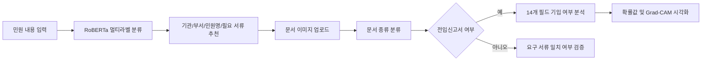
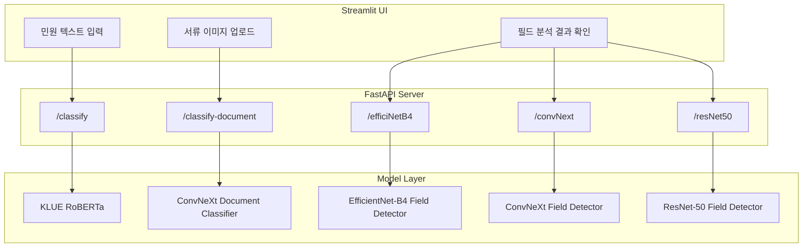

# 지능형 민원처리 시스템

## 프로젝트 개요

지능형 민원처리 시스템은 사용자가 입력한 민원 내용을 분석해 담당 기관, 부서, 민원 유형, 필요 서류를 추천하고, 업로드한 문서 이미지가 요구 서류와 일치하는지 검증하는 AI 기반 민원 보조 서비스입니다.  
또한 전입신고서 이미지에 대해서는 14개 주요 입력 필드의 기입 여부를 다중 라벨 분류로 판별하고, Grad-CAM 기반 시각화를 통해 모델이 주목한 영역을 확인할 수 있도록 구성했습니다.

## 핵심 문제

민원 처리 과정에서는 사용자가 어떤 부서로 가야 하는지, 어떤 서류를 준비해야 하는지, 제출한 문서가 올바른 문서인지 확인하는 데 시간이 많이 소요됩니다. 특히 행정 서식은 항목 누락이나 오기입이 발생하기 쉬워 접수 이후 보완 요청으로 이어질 수 있습니다.

이 프로젝트는 민원 텍스트 분류, 문서 종류 판별, 서식 필드 분석을 하나의 흐름으로 연결해 민원 접수 전 단계의 탐색 비용과 서류 검증 부담을 줄이는 것을 목표로 했습니다.

## 주요 기능

- 민원 텍스트 기반 기관, 부서, 민원명, 필요 서류 추천
- 업로드 문서 이미지의 문서 종류 자동 분류
- 전입신고서 14개 필드 기입 여부 다중 라벨 분석
- EfficientNet-B4, ConvNeXt-Small, ResNet-50 기반 문서 필드 분석 모델 비교
- Grad-CAM++ 기반 모델 판단 근거 시각화
- FastAPI 기반 추론 API 제공
- Streamlit 기반 사용자 테스트 UI 제공
- Whisper 기반 음성 파일 STT 변환 기능 실험

## 서비스 흐름



## 기술 스택

| 영역 | 사용 기술 |
| --- | --- |
| Language | Python 3.12 |
| Deep Learning | PyTorch, Torchvision, Transformers |
| Vision Models | EfficientNet-B4, ConvNeXt-Small, ResNet-50 |
| NLP Model | KLUE RoBERTa 기반 멀티라벨 분류 |
| Optimization | Optuna, Early Stopping |
| Explainability | Grad-CAM, Grad-CAM++ |
| Backend | FastAPI, Uvicorn |
| Frontend / Demo | Streamlit |
| Data Processing | Pandas, NumPy, Pillow, pdf2image, pypdf |
| Visualization / Monitoring | Matplotlib, Plotly, TensorBoard |
| STT Experiment | Whisper |

## 데이터셋

### 민원 텍스트 멀티라벨 데이터

- 학습 데이터: 4,040건
- 검증 데이터: 1,010건
- 테스트 데이터: 1,270건
- 전체 라벨 수: 192개
- 라벨 구성:
  - 기관: 15개
  - 부서: 30개
  - 민원명: 51개
  - 문서: 96개

### 문서 이미지 분류 데이터

| Split | 클래스당 기본 수량 | 총량 |
| --- | ---: | ---: |
| Train | 160장 | 1,280장 |
| Validation | 30장 | 240장 |
| Test | 20-35장 | 195장 |

분류 대상 문서는 여권, 여권신청서, 운전면허증, 임대차계약서, 전입신고서, 주민등록등본, 주민등록증, 확정일자신청서 총 8종입니다.

### 전입신고서 필드 분석 데이터

- 태스크: Multi-label Classification
- 입력 형태: 전입신고서 이미지
- 출력 라벨: 14개 이진 필드
- 주요 필드:
  - 전입자 성명, 주민등록번호, 연락처, 서명도장
  - 이전 주소 관련 시도/시군구
  - 현 세대주 성명, 연락처, 서명도장, 주소
  - 전입사유 체크, 우편물서비스 동의 체크
  - 신청인 성명, 신청인 서명도장

## 모델링 전략

### 1. 민원 텍스트 분류

민원 문장을 입력받아 기관, 부서, 민원명, 필요 문서를 동시에 예측하기 위해 KLUE RoBERTa 기반 멀티라벨 분류 모델을 사용했습니다. 출력 라벨은 `기관:`, `부서:`, `민원명:`, `문서:` 접두어를 기준으로 후처리하여 사용자 화면에 구분 표시합니다.

### 2. 문서 종류 분류

사용자가 업로드한 이미지가 추천된 서류와 일치하는지 확인하기 위해 ConvNeXt-Small 기반 문서 이미지 분류 모델을 구성했습니다. 서비스에서는 여권, 주민등록증, 전입신고서 등 8개 문서 클래스를 분류합니다.

### 3. 전입신고서 필드 분석

전입신고서 내 14개 항목의 기입 여부를 독립적으로 판단하기 위해 `BCEWithLogitsLoss` 기반 다중 라벨 분류를 적용했습니다. EfficientNet-B4, ConvNeXt-Small, ResNet-50을 비교하며 모델별 fine-tuning 대상 레이어, classifier 구조, Grad-CAM target layer를 다르게 설정했습니다.

## 실험 및 성능

ConvNeXt-Small 기반 전입신고서 필드 분석 모델은 문서 서식의 위치, 표, 입력 필드, 서명/도장 영역과 같은 구조적 패턴을 학습하도록 설계했습니다.

| 실험 | 주요 설정 | 결과 |
| --- | --- | --- |
| 1차 | ImageNet 기본 normalization | Accuracy 0.9598, mAP 0.9870 |
| 2차 | 손글씨 데이터 포함, 4,000장 규모 확장 | mAP 0.9988 |
| 3차 | Optuna 기반 batch size/lr 탐색 | mAP 0.9997 |

최종 실험에서는 Optuna를 활용해 batch size와 learning rate를 탐색했으며, Early Stopping으로 검증 손실이 개선되는 시점의 모델을 저장했습니다.

## 시스템 아키텍처



## API 구성

| Method | Endpoint | 설명 |
| --- | --- | --- |
| GET | `/` | 서버 상태 및 제공 모델 목록 확인 |
| POST | `/classify` | 민원 텍스트 기반 기관/부서/민원/문서 추천 |
| POST | `/classify-document` | 업로드 이미지의 문서 종류 분류 |
| POST | `/efficiNetB4` | EfficientNet-B4 기반 전입신고서 필드 분석 |
| POST | `/convNext` | ConvNeXt 기반 전입신고서 필드 분석 |
| POST | `/resNet50` | ResNet-50 기반 전입신고서 필드 분석 |

## 구현 포인트

- 서버 시작 시 모델을 한 번만 로드하고 FastAPI lifespan/state에 캐싱해 반복 요청 비용을 줄였습니다.
- 이미지 업로드 API에서 EXIF 방향 정보를 보정해 사용자가 촬영한 이미지의 회전 문제를 완화했습니다.
- 다중 라벨 분류 결과는 sigmoid 확률과 threshold를 기준으로 각 필드별 기입 여부를 독립 판단했습니다.
- Grad-CAM++ 결과를 base64 PNG로 반환해 Streamlit 화면에서 바로 시각화할 수 있도록 했습니다.
- Streamlit UI에서 민원 분석, 필요 서류 목록, 문서 업로드, 문서 일치 검증, 전입신고서 필드 분석을 하나의 사용자 흐름으로 구성했습니다.

## 프로젝트 구조

```text
TEAM-PJ-DEEP/
├─ backend/
│  └─ fastapi_main.py              # FastAPI 통합 추론 서버
├─ streamlit/
│  └─ streamlit_main.py            # 사용자 테스트 UI
├─ data/
│  ├─ train_multilabel.csv         # 민원 텍스트 학습 데이터
│  ├─ valid_multilabel.csv
│  ├─ test_multilabel.csv
│  ├─ multilabel_classes.json      # 192개 멀티라벨 정의
│  └─ dataset/                     # 8종 문서 이미지 데이터셋
├─ convNext/
│  ├─ convNext_main.py
│  └─ workflow.md
├─ efficiNetB4/
│  ├─ efficiNetB4_main.py
│  └─ workflow.md
├─ resNet/
│  ├─ resNet50_main.py
│  └─ workflow.md
├─ multi_label/
│  └─ multi_label_main.py
├─ stt/
│  └─ whisper_main.py
└─ document_forms_source/
   └─ document_form_dataset_guide_v3.md
```

## 실행 방법

### FastAPI 서버

```bash
uvicorn backend.fastapi_main:app --host 0.0.0.0 --port 8000 --reload
```

Swagger 문서:

```text
http://localhost:8000/docs
```

### Streamlit UI

```bash
uv run streamlit run streamlit/streamlit_main.py
```

접속 주소:

```text
http://localhost:8501
```

### Whisper STT 실험

```bash
python stt/whisper_main.py Leejamsample.mp3
```

## 성과 및 배운 점

- 텍스트 분류와 이미지 분류를 결합해 민원 접수 전 과정을 하나의 AI 서비스 흐름으로 설계했습니다.
- 단일 문서 검증을 넘어, 전입신고서 내부 필드 누락 여부까지 분석하는 세부 검증 기능을 구현했습니다.
- EfficientNet-B4, ConvNeXt-Small, ResNet-50을 같은 태스크에 적용하며 모델 구조별 classifier 교체, fine-tuning 범위, Grad-CAM target layer 차이를 비교했습니다.
- Optuna, Early Stopping, TensorBoard를 활용해 실험 관리와 모델 최적화 과정을 체계화했습니다.
- Grad-CAM 기반 시각화를 통해 단순 예측 결과뿐 아니라 모델 판단 근거를 사용자에게 설명할 수 있는 형태로 확장했습니다.

## 개선 가능성

- 실제 운영 환경에서는 개인정보가 포함된 행정 문서를 다루므로 비식별화, 암호화 저장, 업로드 파일 자동 삭제 정책이 필요합니다.
- 현재 문서 필드 분석은 전입신고서 중심이므로 다른 행정 서식으로 확장하려면 서식별 라벨 체계와 학습 데이터가 추가되어야 합니다.
- OCR 기반 텍스트 추출과 LayoutLM 계열 모델을 결합하면 서식 레이아웃과 기입 텍스트 의미를 함께 활용할 수 있습니다.
- API 에러 응답 스키마를 통일하고, 모델 파일 부재 시 명확한 진단 메시지를 반환하도록 개선할 수 있습니다.

## 포트폴리오 한 줄 요약

민원 텍스트 분류, 문서 종류 검증, 전입신고서 필드 누락 분석을 FastAPI와 Streamlit으로 통합한 AI 기반 지능형 민원처리 서비스입니다.
