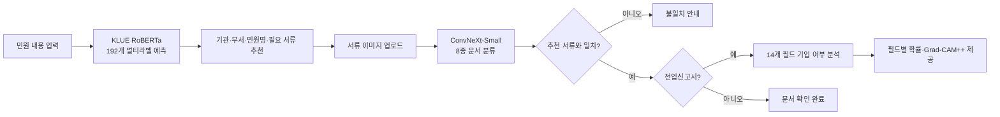
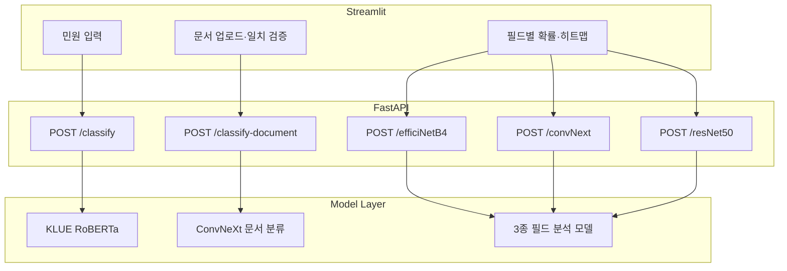

# 지능형 민원처리 시스템

> 민원 내용 분석부터 제출 서류 확인, 전입신고서 기입 누락 탐지까지 하나의 흐름으로 연결한 AI 기반 민원 접수 보조 서비스

[GitHub 저장소](https://github.com/fdt15ss/PJ02-DEEP)

## 프로젝트 정보

| 항목 | 내용 |
| --- | --- |
| 기간 | 2026.03 |
| 형태 | 4인 팀 프로젝트 |
| 개발 범위 | AI 모델 학습·평가, FastAPI 추론 API, Streamlit 데모 |
| 개인 담당 | 행정 서식 데이터 전처리, ConvNeXt-Small 기반 14개 필드 분류, Optuna 최적화, Grad-CAM 분석, 모델 테스트 UI 및 실험 문서화 |
| 현재 상태 | 로컬 환경에서 실행 가능한 프로토타입 |

> 아래에서 “전체 시스템”은 팀이 공동 구현한 범위를, “개인 담당”은 직접 수행한 작업을 구분해 설명합니다.

## 핵심 성과

- 민원 텍스트의 **192개 라벨 예측**, 제출 문서의 **8종 분류**, 전입신고서의 **14개 필드 기입 여부 판별**을 하나의 사용자 흐름으로 통합했습니다.
- 개인 담당 모델인 ConvNeXt-Small의 보유 데이터 분할 평가에서 **mAP 0.9870 → 0.9997**로 1.27%p 개선했습니다.
- PDF 첫 페이지 추출, 300 DPI 이미지 변환, 데이터 분할, 라벨 CSV 생성부터 학습·평가·시각화까지 재사용 가능한 파이프라인을 구성했습니다.
- 높은 mAP만으로 모델의 판단 근거까지 신뢰할 수 없음을 Grad-CAM 분석으로 확인하고, 레이아웃 편향과 데이터 누수 가능성을 후속 과제로 도출했습니다.

## 해결하려는 문제

민원인은 접수 전에 다음 정보를 각각 찾아야 합니다.

1. 어느 기관과 부서가 담당하는가?
2. 어떤 민원으로 접수하고 어떤 서류를 준비해야 하는가?
3. 준비한 문서가 요구 서류와 일치하는가?
4. 전입신고서의 필수 항목을 빠뜨리지 않았는가?

이 탐색과 확인 과정이 분리되어 있으면 접수 이후 서류 보완 요청이 반복될 수 있습니다. 이 프로젝트는 텍스트 분류와 문서 이미지 분석을 연결해 접수 전 확인 비용을 줄이는 것을 목표로 했습니다.

## 전체 서비스 흐름



## 개인 담당

### 1. 행정 서식 데이터 파이프라인

- 여러 페이지 PDF에서 분석 대상인 첫 페이지만 분리했습니다.
- PDF를 300 DPI JPG로 변환하고 파일명과 라벨 폴더 구조를 정리했습니다.
- Train/Validation/Test를 물리적으로 분리하고, 이미지별 14개 이진 라벨을 담은 CSV를 생성했습니다.
- 멀티라벨 데이터 구조에 맞춰 `ImageFolder` 대신 CSV를 읽는 커스텀 `Dataset`을 구현했습니다.

관련 자료:

- [전입신고서 데이터셋 가이드](document_forms_source/document_form_dataset_guide_v3.md)
- [ConvNeXt 실험 보고서](document_forms_source/readme.md)

### 2. ConvNeXt-Small 기반 필드 누락 분석

전입신고서의 14개 항목은 서로 배타적인 클래스가 아닙니다. 한 이미지에서 여러 항목이 동시에 기입되거나 비어 있을 수 있으므로, 단일 클래스 분류가 아닌 **다중 라벨 분류**로 정의했습니다.

| 설계 항목 | 적용 내용 | 선택 이유 |
| --- | --- | --- |
| Backbone | ImageNet 사전학습 ConvNeXt-Small | 표, 필드 위치, 서명 영역 등 문서의 구조적 패턴 학습 |
| Classifier | `Linear(768, 14)` | 사전학습 출력층을 14개 필드에 맞게 교체 |
| Loss | `BCEWithLogitsLoss` | 각 필드의 기입 여부를 독립적인 이진 문제로 학습 |
| Fine-tuning | 후반 feature stage 중심 | 작은 데이터셋에서 전체 파라미터 학습에 따른 과적합 완화 |
| Augmentation | 밝기·대비 변화 | 스캔·촬영 환경 차이 반영 |
| 제외한 증강 | 좌우 반전 | 고정된 서식의 필드 위치가 뒤집히는 비현실적 데이터 방지 |
| Optimization | Optuna로 batch size와 learning rate 탐색 | 수동 튜닝 편향과 반복 비용 감소 |
| Regularization | Early Stopping, patience 3 | 검증 손실이 악화되는 구간의 과적합 제한 |

학습 파이프라인은 [convNext/convNext_main.py](convNext/convNext_main.py), 설계 근거는 [convNext/workflow.md](convNext/workflow.md)에서 확인할 수 있습니다.

### 3. 모델 평가와 설명 가능성 분석

14개 필드마다 sigmoid 확률을 계산하고 임계값을 적용해 기입 여부를 판단했습니다. 정답 비율만 보는 Accuracy의 한계를 보완하기 위해 필드별 AP를 계산한 뒤 평균한 mAP를 핵심 지표로 사용했습니다.

| 실험 | 변경 내용 | 결과 |
| --- | --- | ---: |
| 1차 | ImageNet 기본 전처리 | Accuracy 0.9598, mAP 0.9870 |
| 2차 | 손글씨 데이터 포함, 약 4,000장 규모로 확장 | mAP 0.9988 |
| 3차 | Optuna 기반 batch size·learning rate 탐색 | **mAP 0.9997** |

3차 실험의 최적 탐색값은 batch size 6, learning rate 약 0.000962였습니다. 1차 대비 mAP는 1.27%p, 2차 대비 0.09%p 향상됐습니다.

> 위 수치는 프로젝트 내부 데이터 분할에서 측정한 결과입니다. 고정 서식의 유사 이미지와 데이터 확장 과정이 지표를 높였을 가능성이 있으므로, 실제 행정 문서 전체에 대한 일반화 성능으로 해석하지 않았습니다.

Grad-CAM++로 모델이 주목한 영역도 확인했습니다.


시각화에서는 일부 예측이 실제 필드가 아닌 문서 가장자리나 고정 레이아웃을 참고하는 현상이 관찰됐습니다. 이는 **높은 mAP와 설명의 타당성이 같은 의미가 아님**을 보여줬습니다. 따라서 Grad-CAM은 신뢰성을 보장하는 장치가 아니라, 위치 편향과 잘못된 단서를 발견하기 위한 진단 도구로 사용했습니다.

### 4. 모델 테스트 UI와 실험 문서화

- ConvNeXt 체크포인트를 선택해 결과를 비교할 수 있는 Streamlit 모델 테스터를 구성했습니다.
- 필드별 확률과 Grad-CAM 결과를 화면에서 확인하도록 연결했습니다.
- Optuna study와 모델별 실험 조건, 실행 방법, 평가 지표 정의를 문서화했습니다.

관련 코드는 [streamlit/model_tester_convnext.py](streamlit/model_tester_convnext.py)에서 확인할 수 있습니다.

## 팀 공동 구현 범위

### 민원 텍스트 분류

KLUE RoBERTa를 이용해 하나의 민원 문장에서 기관, 부서, 민원명, 필요 문서를 동시에 예측합니다. 임계값 이상의 라벨을 선택한 뒤 `기관:`, `부서:`, `민원명:`, `문서:` 접두어를 기준으로 화면에 구분해 표시합니다.

| 데이터 | 건수 |
| --- | ---: |
| Train | 4,040 |
| Validation | 1,010 |
| Test | 1,270 |
| 전체 라벨 | 192 |

라벨은 기관 15개, 부서 30개, 민원명 51개, 문서 96개로 구성됩니다.

### 문서 종류 분류

ConvNeXt-Small로 업로드 문서를 다음 8종으로 분류하고, 민원 텍스트 모델이 추천한 서류와 일치하는지 확인합니다.

- 여권
- 여권신청서
- 운전면허증
- 임대차계약서
- 전입신고서
- 주민등록등본
- 주민등록증
- 확정일자신청서

| Split | 클래스별 수량 | 총량 |
| --- | ---: | ---: |
| Train | 160장 | 1,280장 |
| Validation | 30장 | 240장 |
| Test | 20~35장 | 195장 |

### 필드 분석 모델 비교

동일한 14개 필드 태스크에 EfficientNet-B4, ConvNeXt-Small, ResNet-50을 적용했습니다. 모델마다 classifier 교체 위치, fine-tuning 범위, Grad-CAM target layer가 달라 공통 인터페이스를 유지하면서 백본별 추론 로직을 분리했습니다.

## 시스템 구성



### API

| Method | Endpoint | 설명 |
| --- | --- | --- |
| GET | `/` | 서버 상태와 제공 기능 확인 |
| POST | `/classify` | 민원 텍스트 기반 기관·부서·민원명·문서 추천 |
| POST | `/classify-document` | 업로드 이미지의 8종 문서 분류 |
| POST | `/efficiNetB4` | EfficientNet-B4 기반 14개 필드 분석 |
| POST | `/convNext` | ConvNeXt-Small 기반 14개 필드 분석 |
| POST | `/resNet50` | ResNet-50 기반 14개 필드 분석 |

통합 추론 코드는 [backend/fastapi_main.py](backend/fastapi_main.py), 사용자 흐름은 [streamlit/streamlit_main.py](streamlit/streamlit_main.py)에 구현했습니다.

### 구현 포인트

- 모델을 서버 기동 시 로드하고 재사용해 요청마다 체크포인트를 다시 읽는 비용을 줄였습니다.
- `ImageOps.exif_transpose`로 촬영 이미지의 EXIF 회전 정보를 보정했습니다.
- 필드별 sigmoid 확률과 임계값을 사용해 14개 라벨을 독립적으로 판단했습니다.
- Grad-CAM++ 결과를 base64 PNG로 반환해 Streamlit에서 바로 표시했습니다.
- PyTorch 모델의 서로 다른 classifier와 target layer를 API 안에서 모델 타입별로 처리했습니다.

## 기술 스택

버전은 `pyproject.toml`의 선언과 `requirements.txt`에 고정된 실제 설치 버전을 기준으로 정리했습니다.

### 실행 환경

| 항목 | 버전 | 비고 |
| --- | --- | --- |
| Python | **3.12** | `requires-python = ">=3.12"`, `.python-version`으로 고정 |
| 패키지 관리 | **uv** | `uv.lock`으로 전체 의존성 트리 잠금, `uv sync` 단일 명령 재현 |
| GPU 런타임 | **CUDA 12.6** | `download.pytorch.org/whl/cu126` 를 explicit index로 분리 |
| 개발 환경 | Jupyter(ipykernel 7.2.0), nbformat 5.10.4 | 전처리·Optuna 탐색은 노트북, 학습 본체는 `.py` 스크립트 |

> **왜 index를 분리했나:** PyPI 기본 `torch`는 CPU 빌드 또는 다른 CUDA 빌드가 설치될 수 있습니다. `[[tool.uv.index]] explicit = true` + `[tool.uv.sources]`로 `torch`/`torchvision`만 PyTorch cu126 인덱스에서 받도록 고정해, 팀원 간 GPU 빌드 불일치를 차단했습니다.

### 딥러닝 코어

| 라이브러리 | 버전 | 프로젝트에서의 역할 |
| --- | --- | --- |
| **torch** | **2.10.0+cu126** | 학습 루프, `BCEWithLogitsLoss`, Adam, freeze/unfreeze 제어 |
| **torchvision** | **0.25.0+cu126** | `convnext_small` / `efficientnet_b4` / `resnet50` 백본과 사전학습 가중치, `transforms` 전처리 |
| **transformers** | **5.3.0** | `AutoTokenizer` + `AutoModelForSequenceClassification` (`problem_type="multi_label_classification"`) |
| tokenizers | 0.22.2 | KLUE RoBERTa 토크나이저 백엔드 |
| huggingface-hub | 1.5.0 | `klue/roberta-base` 체크포인트 다운로드·캐시 |
| safetensors | 0.7.0 | HF 가중치 로드 포맷 |
| **numpy** | **2.4.2** | NumPy 2.x 계열 — 배열 연산, 지표 계산 |

### 학습 최적화 · 평가 · 해석

| 라이브러리 | 버전 | 프로젝트에서의 역할 |
| --- | --- | --- |
| **optuna** | **4.7.0** | batch size(`[4, 8, 16]`) · learning rate(`1e-5~1e-3` loguniform) 탐색, 20 trials, `should_prune()` 조기 종료 |
| sqlalchemy / alembic | 2.0.48 / 1.18.4 | Optuna study 저장소 백엔드 (transitive) |
| **scikit-learn** | **1.8.0** | `average_precision_score`(AP·mAP), `f1_score`(micro/macro/weighted) |
| scipy | 1.17.1 | scikit-learn 연산 의존 |
| **grad-cam** | **1.5.5** | `GradCAM`, `GradCAMPlusPlus`, `ClassifierOutputTarget` |
| ttach | 0.0.3 | grad-cam의 TTA 의존 |
| opencv-python | 4.13.0.92 | Grad-CAM 히트맵 오버레이(`show_cam_on_image`) |
| **tensorboard** | **2.20.0** | `Loss/train`(배치), `Loss/val`·`Acc/val`(에포크) 기록 |
| matplotlib | 3.10.8 | Grad-CAM 비교 subplot, 학습 곡선 저장 |
| tqdm | 4.67.3 | 에포크·배치 진행 표시 |

### 모델 (가중치 버전 포함)

| 태스크 | 모델 | 가중치 지정 | 출력 |
| --- | --- | --- | --- |
| 민원 텍스트 분류 | **KLUE RoBERTa-base** | `klue/roberta-base` (HF Hub) | 192 logit → sigmoid, threshold 0.4 |
| 문서 종류 분류 | **ConvNeXt-Small** | 백엔드에서 학습 체크포인트 로드 | 8 logit → softmax |
| 필드 분석 (주력) | **ConvNeXt-Small** (약 50M params) | `ConvNeXt_Small_Weights.IMAGENET1K_V1` | `classifier[2] = Linear(768, 14)` |
| 필드 분석 (비교) | **EfficientNet-B4** | `EfficientNet_B4_Weights.DEFAULT` | `classifier[1] = Linear(1792, 14)` |
| 필드 분석 (비교) | **ResNet-50** | `ResNet50_Weights.DEFAULT` | `fc = Linear(2048, 14)` |

> 필드 분석 3종은 모두 입력 224×224 RGB, `BCEWithLogitsLoss`, threshold 0.5로 평가 조건을 통일했습니다.

### 서빙 · UI

| 라이브러리 | 버전 | 프로젝트에서의 역할 |
| --- | --- | --- |
| **fastapi** | **0.135.1** | 6개 엔드포인트, lifespan에서 모델 사전 로드 |
| starlette | 0.52.1 | FastAPI ASGI 기반 |
| **uvicorn** | **0.41.0** | ASGI 서버 (`--host 0.0.0.0 --port 8000`) |
| **pydantic** | **2.12.5** | 요청·응답 스키마 정의와 자동 검증 (v2 계열) |
| python-multipart | 0.0.22 | 이미지 `UploadFile` 처리 |
| **streamlit** | **1.55.0** | 통합 사용자 UI, ConvNeXt 모델 테스터 |
| plotly | 6.6.0 | 필드별 확률 시각화 |
| altair | **4.2.2** (`altair<5` 고정) | Streamlit 차트 렌더링 호환 |

### 데이터 처리

| 라이브러리 | 버전 | 프로젝트에서의 역할 |
| --- | --- | --- |
| **pandas** | **2.3.3** (`pandas<3` 고정) | 14개 이진 라벨 CSV 생성·로드, split 관리 |
| **pillow** | **12.1.1** | 이미지 로드, `ImageOps.exif_transpose` 회전 보정 |
| **pypdf** | **6.7.5** | 다중 페이지 PDF에서 1페이지만 분리 |
| **pdf2image** | **1.17.0** | PDF → **300 DPI** JPG 변환 (Poppler 필요) |
| openpyxl | 3.1.5 | 라벨링 시트 입출력 |

### 버전을 명시적으로 고정한 이유

| 고정 | 값 | 이유 |
| --- | --- | --- |
| `altair<5` | 4.2.2 | Streamlit 차트 계층이 altair 5.x에서 렌더링·API 차이를 일으켜 하위 버전으로 고정 |
| `pandas<3` | 2.3.3 | pandas 3.x의 동작 변경이 라벨 CSV 처리와 Streamlit 표시에 영향을 줄 수 있어 2.x 계열 유지 |
| `setuptools==81` | 81.0.0 | 일부 패키지의 빌드 훅 호환 문제로 정확한 버전 고정 |
| protobuf | 3.20.3 | TensorBoard 로그 직렬화 호환 유지 |
| torch/torchvision | `+cu126` 접미사 | CPU 빌드 혼입 방지 — 접미사가 없으면 GPU 학습이 조용히 CPU로 떨어짐 |

## 프로젝트 구조

```text
PJ02-DEEP/
├─ backend/
│  └─ fastapi_main.py                 # 통합 추론 API
├─ streamlit/
│  ├─ streamlit_main.py               # 통합 사용자 UI
│  └─ model_tester_convnext.py        # ConvNeXt 실험 UI
├─ data/
│  ├─ *_multilabel.csv                # 민원 텍스트 데이터
│  ├─ multilabel_classes.json         # 192개 라벨
│  └─ dataset/                        # 8종 문서 이미지
├─ multi_label/
│  └─ multi_label_main.py             # KLUE RoBERTa 학습
├─ convNext/
│  └─ convNext_main.py                # ConvNeXt 필드 분석
├─ efficiNetB4/
│  └─ efficiNetB4_main.py             # EfficientNet-B4 필드 분석
├─ resNet/
│  └─ resNet50_main.py                # ResNet-50 필드 분석
├─ document_forms_source/             # 전처리·Optuna 노트북과 실험 문서
└─ stt/
   └─ whisper_main.py                 # Whisper STT 실험
```

## 실행 방법

Python 3.12와 [uv](https://docs.astral.sh/uv/)가 필요합니다.

```bash
# 의존성 설치
uv sync

# FastAPI 서버
uv run uvicorn backend.fastapi_main:app --host 0.0.0.0 --port 8000

# Streamlit 통합 UI
uv run streamlit run streamlit/streamlit_main.py
```

- API 문서: `http://localhost:8000/docs`
- Streamlit UI: `http://localhost:8501`

필드 분석 학습 스크립트는 데이터 경로와 CUDA 장치 설정을 실행 환경에 맞게 조정해야 합니다.

## 시행착오와 배운 점

> 세 가지 시행착오는 각각 프로젝트 전체를 관통한 문제였습니다. 항목명은 **무엇을 잘못 판단했는가 — 그래서 무엇을 배웠는가** 형태로 붙였고, 하위 항목명은 **상황 → 가설과 시도 → 관찰 → 원인 분석 → 결론과 다시 한다면** 다섯 단계로 통일했습니다. 항목에 따라 같은 단계가 ①②③으로 반복되거나, 해당하지 않는 단계는 생략됩니다.

---

### 시행착오 1. 같은 이미지를 복제해 데이터를 늘렸다 — 수는 늘었지만 다양성은 그대로였다

#### 1-1. 상황: 649장에서 시작한 학습

첫 ConvNeXt 실험의 데이터는 Train 649장 / Validation 147장 / Test 151장이었습니다. 전입신고서 PDF를 첫 페이지만 분리해 300 DPI JPG로 변환하고, 14개 필드의 기입 여부를 이진 라벨로 붙여 만든 데이터입니다.

문제는 학습 곡선이었습니다. 에포크마다 validation loss가 크게 흔들려 모델이 수렴한 것인지, 아직 학습이 부족한 것인지, 이미 과적합에 들어간 것인지 구분되지 않았습니다. Early Stopping의 patience 3이 어느 시점을 잡아낸 것인지도 신뢰하기 어려웠습니다.

이때 세운 가설은 **"데이터가 적어 에포크당 gradient update 횟수가 부족하고, 그래서 학습이 불안정하다"** 였습니다.

#### 1-2. 가설과 시도 ①: 동일 데이터를 반복 배치해 행 수를 늘림

가설에 따라 같은 이미지를 라벨 CSV에 반복 등록해 데이터셋의 행 수를 늘렸습니다. batch size가 고정된 상태에서 데이터가 늘면 에포크당 배치 수가 늘고, 그만큼 파라미터 업데이트가 많아지므로 곡선이 부드러워질 것으로 기대했습니다.

결과적으로 train loss 곡선의 변동은 실제로 줄었습니다. 겉으로는 가설이 맞은 것처럼 보였습니다.

#### 1-3. 관찰과 원인 분석 ①: 늘어난 것과 늘어나지 않은 것

| 관점 | 중복 확장으로 늘어난 것 | 중복 확장으로 늘지 않은 것 |
| --- | --- | --- |
| 학습 절차 | 에포크당 배치 수, gradient update 횟수 | — |
| 데이터 형태 | 라벨 CSV의 행 수, 디스크 용량 | 독립적인 원본 문서 ID의 수 |
| 정보량 | — | 손실 함수가 실제로 본 서로 다른 픽셀 패턴 |
| 도메인 분포 | — | 손글씨 필체, 필기구, 조명·그림자, 스캔 해상도, 서식 버전 |
| 지표 | train loss 곡선의 안정성 | validation 기준 일반화 성능 |

핵심은 **손실 함수 관점에서 아무것도 바뀌지 않았다**는 점입니다. 같은 이미지를 10번 보여주는 것은 그 샘플의 gradient에 10배 가중치를 주는 것과 다르지 않습니다. 곡선이 부드러워진 이유도 "학습이 잘 돼서"가 아니라 배치 간 분산이 줄었기 때문이며, 이는 오히려 특정 샘플의 암기를 강화하는 방향이었습니다.

정리하면, 늘린 것은 **학습 횟수**였고 필요했던 것은 **정보 다양성**이었습니다. 두 개를 같은 것으로 착각한 것이 시행착오의 본질이었습니다.

#### 1-4. 가설과 시도 ②: 실제 다양성을 추가하는 세 가지 축

가설을 폐기하고 데이터 자체를 다시 봤습니다. 이후 세 가지 축에서 데이터를 확장했습니다.

**축 1 — 손글씨 데이터 추가.** 기존 데이터는 필드가 인쇄 텍스트로 채워진 경우가 많았습니다. 실제 민원 창구에서 제출되는 전입신고서는 대부분 손으로 쓰기 때문에, 손글씨가 포함된 서식을 추가해 데이터셋을 약 4,000장 규모로 확장했습니다. 새로운 필체, 필기구 굵기, 기울기, 칸을 벗어나는 글씨가 함께 들어왔습니다.

**축 2 — 도메인에 맞는 증강만 선택.** ImageNet 계열 이미지 분류에서 관습적으로 쓰는 증강 세트를 그대로 쓰지 않고, "이 변형이 실제 문서 수집 과정에서 발생하는가"를 기준으로 채택 여부를 판단했습니다.

| 증강 | 적용 | 판단 근거 |
| --- | :---: | --- |
| `ColorJitter(brightness=0.2, contrast=0.2)` | **채택** | 스캐너·복사기·휴대폰 촬영마다 밝기와 대비 편차가 실제로 존재하는 변형 |
| `RandomHorizontalFlip` | **제외** | 전입신고서는 필드 위치가 고정된 정형 서식. 좌우 반전하면 "전입자 성명"과 "신청인 서명도장"의 공간 관계가 역전되어, 현실에 존재할 수 없는 이미지를 학습하게 됨 |
| `RandomRotation` / `RandomAffine` / `RandomPerspective` | 초기 실험에만 | 휴대폰 촬영의 기울어짐 재현에는 유효하지만, 강도가 크면 필드 경계가 잘려 이미지와 라벨이 불일치 |
| Validation / Test 증강 | **미적용** | 평가 세트에는 리사이즈와 정규화만 적용해 평가 조건을 고정 |

좌우 반전 제외는 사소해 보이지만, "일반적으로 성능이 오르는 증강"과 "이 도메인에서 유효한 증강"이 다르다는 것을 보여주는 대표적인 사례였습니다.

**축 3 — 데이터 분포에 맞는 정규화.** ImageNet 정규화 값은 자연 이미지의 통계입니다. 그런데 행정 서식은 배경이 흰색에 가깝고 픽셀 분산이 극단적으로 작은 특수한 분포입니다. 실제로 데이터셋에서 직접 계산한 값은 다음과 같았습니다.

```
1회차  (ImageNet 기본)
    mean = [0.485, 0.456, 0.406]
    std  = [0.229, 0.224, 0.225]

2·3회차 (데이터셋에서 직접 계산)
    mean = [0.9367, 0.9364, 0.9358]
    std  = [0.0957, 0.0964, 0.0963]
```

평균이 0.94 부근, 표준편차가 0.10 이하로 완전히 다른 분포였습니다. ImageNet 값으로 정규화하면 입력 대부분이 한쪽으로 치우친 좁은 구간에 몰려 초기 학습 효율이 떨어집니다. 2·3회차에서 커스텀 정규화 값을 적용했습니다.

#### 1-5. 가설과 시도 ③: 하이퍼파라미터에도 근거를 부여

데이터를 정리한 뒤에도 batch size 8, learning rate 1e-4는 "일반적으로 무난한 값"이라는 이유로 쓰고 있었습니다. 정당화할 근거가 없다는 점이 걸려 Optuna 탐색을 도입했습니다.

| 항목 | 설정 | 선택 이유 |
| --- | --- | --- |
| 탐색 대상 | `batch_size` (categorical `[4, 8, 16]`), `lr` (loguniform `1e-5 ~ 1e-3`) | 소규모 데이터에서 두 값이 수렴에 가장 큰 영향을 줌 |
| lr 분포 | **loguniform** | learning rate는 자릿수 단위로 영향을 주는 파라미터. uniform으로 두면 샘플 대부분이 `1e-4` 이상 구간에 몰림 |
| 목적 함수 | validation loss 최소화 | 학습 중 직접 관측 가능한 지표 |
| trial 수 | 20 | 탐색 범위와 GPU 시간의 균형 |
| trial당 epoch | 5 | 전체 학습이 아닌 "수렴 방향" 판단용 |
| Pruning | `trial.report(val_loss, epoch)` + `trial.should_prune()` | 가망 없는 trial을 5 epoch 다 채우지 않고 중단 |

Pruning 덕분에 20 trial 전체를 정식 학습하는 비용의 일부만으로 탐색을 마칠 수 있었습니다.

#### 1-6. 관찰과 원인 분석 ②: 3회차 실험 결과와 개선폭의 분포

| 실험 | 변경 내용 | 데이터 | Accuracy | mAP |
| --- | --- | ---: | ---: | ---: |
| 1차 | ImageNet 기본 전처리·정규화 | 649장 | 0.9598 | 0.9870 |
| 2차 | 손글씨 데이터 포함, 커스텀 정규화 | 약 4,000장 | — | 0.9988 |
| 3차 | Optuna로 batch size·learning rate 탐색 | 약 4,000장 | — | **0.9997** |

3차의 최적 탐색값은 **batch size 6, learning rate 약 0.000962**였습니다. 1차 대비 mAP 1.27%p, 2차 대비 0.09%p 향상입니다.

여기서 주목한 것은 개선폭의 분포입니다. **1차 → 2차(데이터 다양성 확장)에서 1.18%p, 2차 → 3차(하이퍼파라미터 최적화)에서 0.09%p**가 올랐습니다. 즉 성능을 실제로 움직인 것은 하이퍼파라미터가 아니라 데이터였고, Optuna의 진짜 이득은 수치 개선보다 **"왜 이 값인가"에 답할 수 있게 된 것**이었습니다.

#### 1-7. 결론과 다시 한다면: 데이터를 늘리기 전에 세는 세 가지

이 과정을 거치며 데이터셋을 평가하는 기준이 바뀌었습니다. 이제는 데이터를 늘리기 전에 먼저 세 가지를 셉니다.

1. **독립적인 원본 문서 ID의 수** — 파생·복제를 제외한 진짜 원본이 몇 개인가
2. **수집 조건의 조합 수** — 필체 × 필기구 × 조명 × 스캔 품질 × 서식 버전
3. **라벨별 양성 샘플 수** — 14개 필드 각각에 대해 최소 몇 장을 확보했는가

이 셋 중 하나도 늘지 않는 확장은 "데이터 추가"가 아니라 "반복"이라고 판단합니다.

또한 실험 방식 자체도 바꾸겠습니다. 당시에는 데이터 확장, 정규화 변경, 하이퍼파라미터 탐색이 회차별로 섞여 있어 각 요인의 기여도를 정확히 분리할 수 없었습니다. **실험 전에 가설·변경 변수·성공 지표를 먼저 정하고 한 번에 하나의 요인만 바꾸는 것**이 다음 프로젝트의 기본 규칙입니다.

---

### 시행착오 2. mAP 0.9997을 성능의 증거로 받아들였다 — 지표는 판단 근거의 타당성을 보증하지 않았다

#### 2-1. 상황: mAP 0.9997을 그대로 믿을 수 없었던 이유

3차 실험에서 mAP 0.9997이 나왔습니다. 수치만 보면 더 손댈 것이 없는 모델입니다. 그런데 전입신고서라는 데이터의 성격이 걸렸습니다.

전입신고서는 **레이아웃이 고정된 정형 서식**입니다. "전입자 성명" 칸은 항상 같은 위치에 있고, "신청인 서명도장" 칸도 마찬가지입니다. 이런 데이터에서는 모델이 두 가지 중 어느 쪽을 학습해도 지표가 높게 나옵니다.

- (A) 해당 위치에 **무엇이 기입됐는가**를 판단 — 우리가 원하는 것
- (B) 이 서식에서 그 위치는 **대개 채워져 있다**는 사전 분포를 암기 — 원하지 않는 것

지표만으로는 A와 B를 구분할 수 없습니다. 높은 mAP는 "모델이 맞혔다"는 증거일 뿐, **"옳은 이유로 맞혔다"는 증거가 아니었습니다.**

#### 2-2. 가설과 시도 ①: 지표 자체를 다시 설계

원래 출력하던 지표는 element-wise accuracy였습니다. 이것부터 문제가 있었습니다.

| 지표 | 계산 방식 | 이 프로젝트에서의 한계 |
| --- | --- | --- |
| Element-wise Accuracy | 전체 샘플 × 14 라벨의 개별 판정을 세어 맞은 비율 | 음성 라벨이 많으면 "대부분 미기입"으로 찍어도 높게 나옴 |
| Subset Accuracy | 한 문서의 14개 라벨을 **전부** 맞혀야 정답 | 지나치게 엄격해 개선 방향을 보여주지 못함 |
| Micro F1 | 전체 TP/FP/FN을 합산 | 빈도 높은 라벨의 영향이 지배적 |
| **Macro F1** | 라벨별 F1을 동일 가중 평균 | 희소하거나 어려운 필드의 실패가 드러남 |
| **mAP** | 14개 필드의 AP를 평균 | threshold에 의존하지 않고 확률 순위 품질 자체를 평가 |

핵심 지표를 mAP로 바꾼 이유는 **threshold 독립성**입니다. Accuracy와 F1은 0.5라는 임의의 임계값에 따라 값이 크게 달라지지만, AP는 precision-recall 곡선 아래 면적이므로 모델이 매긴 확률 순서의 품질을 직접 평가합니다. 임계값을 아직 튜닝하지 않은 단계에서 모델을 비교하기에 적합했습니다.

동시에 행정 서식이라는 도메인에서는 **오류의 비대칭성**도 고려해야 했습니다. 기입된 필드를 누락으로 잘못 판정하면 사용자가 불필요하게 확인하는 정도의 비용이지만, **누락된 필드를 기입됐다고 판정하면 서류 보완 요청으로 이어져 시스템의 존재 이유가 무너집니다.** 즉 누락 탐지의 recall이 precision보다 중요한 문제인데, 당시 평가에는 이 관점이 빠져 있었습니다.

#### 2-3. 가설과 시도 ②: Grad-CAM++로 판단 근거 확인

지표로 A와 B를 구분할 수 없다면, 모델이 실제로 어디를 보는지 확인해야 했습니다. Grad-CAM++를 도입해 14개 필드 각각에 대해 주목 영역을 시각화했습니다.

target layer 선택은 백본마다 달랐습니다.

| 모델 | target layer | 선택 근거 |
| --- | --- | --- |
| ConvNeXt-Small | `features[-1]` (= `features[7]`, 최종 LayerNorm) | 마지막 스테이지 뒤에 독립된 LayerNorm이 분리된 구조 |
| EfficientNet-B4 | `features[-1]` | 마지막 MBConv 블록 출력 |
| ResNet-50 | `layer4[-1]` | 마지막 convolution stage의 마지막 bottleneck |

너무 앞쪽 layer는 엣지·텍스처 같은 저수준 특징만 보이고, 너무 뒤쪽은 공간 해상도가 작아져 위치를 알 수 없습니다. **클래스 의미와 공간 정보가 함께 남아 있는 마지막 convolution 계층**을 모델 구조별로 직접 확인해 지정했습니다. 이 과정에서 `print(model)`로 계층을 실제 출력해 확인하는 습관이 생겼습니다.


#### 2-4. 관찰: 히트맵이 필드를 벗어나 있었다

시각화 결과 일부 예측에서 히트맵이 **해당 필드 영역이 아니라 문서 가장자리나 고정 레이아웃의 표 선**에 걸쳐 있었습니다. 2회차 실험에서는 실제로 미기입이 아닌 항목까지 오류로 판단하는 불안정한 예측 양상도 함께 관찰됐습니다.

지표는 올랐지만 판단 근거는 검증되지 않은 상태라는 것이 확인된 순간이었습니다. mAP 0.9997과 "필드 가장자리를 보고 있는 히트맵"이 같은 모델에서 동시에 나왔습니다.

#### 2-5. 원인 분석 ①: 모델 쪽 가설 세 가지

관찰한 현상의 원인으로 세 가지를 의심했고, 각각에 대한 확인 방법을 정리했습니다.

| 가설 | 내용 | 확인 방법 |
| --- | --- | --- |
| **레이아웃 편향** | 필드의 의미가 아닌 고정 위치를 학습 | 필드 영역만 마스킹했을 때 예측 확률이 바뀌는지 측정. 바뀌지 않으면 그 영역을 실제로 보고 있지 않다는 근거 |
| **데이터 누수** | 같은 원본에서 파생된 이미지가 Train과 Test에 나뉘어 들어감 | 파일 해시와 원본 문서 ID 기준 근접 중복 검사. 현재 분할은 문서 ID 접두사 기준이지만 파생 이미지까지 완전히 통제됐는지 재확인 필요 |
| **평가 세트 난이도 부족** | 고정 서식의 유사 이미지가 다수라 변별력이 낮음 | 다른 서식 버전, 휴대폰 촬영본, 기울어짐·그림자·저해상도 이미지로 별도 외부 테스트 세트 구축 |

#### 2-6. 원인 분석 ②: 설명 도구인 Grad-CAM 자체의 한계

Grad-CAM++를 도입하며 배운 또 하나는, **설명 도구 자체도 무비판적으로 신뢰할 수 없다**는 것입니다.

- Grad-CAM 계열은 gradient 기반의 **사후(post-hoc) 설명**이며 인과관계를 증명하지 않습니다.
- target layer와 정규화 방식에 따라 히트맵이 달라집니다.
- 히트맵이 보기 좋은 영역을 강조한다고 해서 예측이 올바르다는 보장이 없습니다.

따라서 Grad-CAM을 "우리 모델은 이렇게 잘 봅니다"를 보여주는 장식이 아니라, **위치 편향과 잘못된 단서를 발견하기 위한 진단 도구**로 위치를 재정의했습니다. 실제로 이 프로젝트에서 Grad-CAM이 한 일은 성능을 증명한 것이 아니라 **성능에 대한 의심을 만들어낸 것**이었습니다.

#### 2-7. 결론과 다시 한다면: 수치와 함께 그 수치가 성립하는 조건을 말하기

이 경험의 결론은 결과 보고 방식에까지 영향을 미쳤습니다. 포트폴리오와 면접에서 mAP 0.9997을 "일반화 성능"이 아니라 **"프로젝트 내부 데이터 분할에서 측정한 값"** 으로 명시적으로 한정해 설명하기로 했습니다. 높은 수치를 그대로 주장하는 것보다, 그 수치가 성립하는 조건과 한계를 함께 말하는 것이 더 신뢰할 수 있는 설명이라고 판단했습니다.

다시 한다면 다음 순서로 검증하겠습니다.

1. **분할부터 다시.** 파일 해시와 원본 문서 ID로 중복·파생 이미지를 묶어 **그룹 단위 split**을 만듭니다. 누수 가능성을 없앤 뒤에야 지표가 의미를 가집니다.
2. **설명에도 지표를 부여.** 필드 bounding box를 확보해 히트맵과의 IoU 또는 pointing game 점수로 **설명의 타당성을 정량화**합니다. 지표가 설명을 보증하지 않는다면, 설명도 지표를 가져야 합니다.
3. **강건성 테스트 추가.** 필드 영역 마스킹, 위치 이동, 서식 버전 변경에 대해 예측이 어떻게 변하는지 측정합니다.
4. **필드별 threshold 보정.** 현재의 공통 0.5 대신 Validation PR curve로 필드별 임계값을 정하고, Macro F1·필드별 recall·오탐률을 함께 보고합니다.
5. **근본 접근 변경 검토.** OCR과 LayoutLM 계열 모델, 필드 영역 crop 또는 region supervision을 결합해 "어디에 있는가"가 아니라 **"무엇이 기입됐는가"** 를 직접 학습시킵니다.

---

### 시행착오 3. 흐름이 동작하는 것을 완성으로 봤다 — 프로토타입 요구사항과 운영 요구사항은 달랐다

#### 3-1. 상황: 흐름은 돌았지만 그것으로 충분하지 않았다

Streamlit → FastAPI → 4종 모델(텍스트 1종 + 비전 3종)까지 전체 사용자 흐름을 연결해 동작을 검증했습니다. 민원 문장을 넣으면 기관·부서·필요 서류가 나오고, 문서를 올리면 종류를 판별하고, 전입신고서면 14개 필드의 기입 여부와 Grad-CAM++ 히트맵까지 반환됩니다. 데모로서는 완결된 상태였습니다.

그런데 코드를 다시 읽으면서, **학습 단계에서는 문제가 없던 것이 서빙 단계에서는 다르게 동작하는** 지점들을 발견했습니다.

#### 3-2. 관찰 ①: 백본마다 통합 지점이 다르다

먼저 EfficientNet-B4로 파이프라인을 만들고 ConvNeXt-Small로 옮겼는데, 처음에는 모델 생성 한 줄만 바꾸면 될 것으로 생각했습니다. 실제로는 다섯 곳이 함께 바뀌어야 했습니다.

| 항목 | EfficientNet-B4 | ConvNeXt-Small | ResNet-50 | 놓쳤을 때 |
| --- | --- | --- | --- | --- |
| 헤드 위치 | `classifier[1]` | `classifier[2]` | `fc` | 잘못된 레이어를 교체해 Flatten/LayerNorm이 사라지거나 shape 오류 |
| 헤드 입력 차원 | 1792 | **768** | 2048 | `Linear` 입력 차원 불일치로 forward 실패 |
| Fine-tune 대상 | `features[-1]` (MBConv 1블록) | `features[6]` + `features[7]` | `layer4` | ConvNeXt는 마지막 스테이지 뒤에 **독립된 LayerNorm(`features[7]`)** 이 분리되어 있어, 함께 unfreeze하지 않으면 특징 정규화 스케일이 도메인에 맞게 조정되지 않음 |
| Optimizer 등록 | `model.parameters()` | `filter(lambda p: p.requires_grad, ...)` | 동일 | freeze된 파라미터까지 optimizer state를 점유 |
| Grad-CAM target | `features[-1]` | `features[-1]` | `layer4[-1]` | 같은 표현이지만 가리키는 레이어의 성격이 다름 |

ConvNeXt-Small의 실제 구조를 출력해 확인한 뒤에야 freeze 경계를 정할 수 있었습니다.

```
features[0]  Stem (Patch Embedding)     224×224 → 56×56
features[1]  Downsampling + LayerNorm
features[2]  Stage 1 Blocks
features[3]  Downsampling + LayerNorm
features[4]  Stage 2 Blocks
features[5]  Downsampling + LayerNorm     ← 여기까지 동결 (엣지·텍스처 등 범용 저수준 특징)
features[6]  Stage 3 Blocks               ← unfreeze (고수준 의미 특징을 도메인에 적응)
features[7]  LayerNorm                    ← unfreeze (특징 정규화 스케일 조정)
classifier   [0] LayerNorm [1] Flatten [2] Linear(768, 14)   ← [2]만 교체
```

문제는 이 정보가 **학습 스크립트, FastAPI 백엔드, Streamlit 모델 테스터 세 곳에 중복**됐다는 점입니다. 백본을 하나 바꾸면 세 파일을 모두 고쳐야 하고, 한 곳을 빠뜨리면 조용히 어긋납니다.

#### 3-3. 관찰 ②: 오류 없이 조용히 틀리는 실패들

코드 리뷰에서 찾은 문제들을 심각도 순으로 정리하면 다음과 같습니다.

| # | 문제 | 증상 | 왜 위험한가 |
| --- | --- | --- | --- |
| 1 | 일부 ConvNeXt·ResNet 로더가 `model_path.exists()`일 때만 가중치를 로드하고, 없으면 **무작위 초기화 모델을 반환** | 서버는 정상 기동, API는 200 응답 | **가장 위험.** 예측이 완전히 무의미한데 어디에서도 오류가 나지 않음. EfficientNet-B4는 로드가 필수라 없으면 startup에서 실패하는데, 모델마다 동작이 달랐다는 것 자체가 문제 |
| 2 | 필드 분석 3종 모델과 입력 tensor를 `.to(device)`로 옮기지 않아 사실상 CPU 추론 | 응답은 정상, 지연 시간만 큼 | 학습 코드의 GPU 설정과 서빙 코드는 완전히 별개인데 "학습에서 GPU를 썼으니 서빙도 GPU"라고 착각. 오류가 없어 발견이 늦음 |
| 3 | 추론 요청마다 전체 파라미터에 `requires_grad=True` 설정 (Grad-CAM++ 때문) | 메모리 사용량 증가 | 설명이 필요 없는 일반 예측 경로까지 gradient 메모리를 점유. 동시 요청 시 위험 |
| 4 | 루트 API 설명에 이전 백본 이름이 남음 | 문서와 실제 동작 불일치 | 문서 분류 모델을 EfficientNet-B0 → ConvNeXt-Small로 교체하며 docstring을 갱신하지 못한 기술 부채. 모델 이름이 여러 파일에 문자열로 복제된 결과 |
| 5 | 학습 스크립트마다 `cuda:0`, `cuda:1` 하드코딩 | 다른 환경에서 실행 실패 | 재현성과 배포성 저하 |
| 6 | 학습 스크립트가 모듈 최상위에서 바로 학습을 시작 | import만 해도 학습이 돌아감 | 함수 단위 테스트·재사용 불가 |

1번이 이 프로젝트에서 얻은 가장 중요한 교훈입니다. **오류를 내며 죽는 실패보다, 정상처럼 보이면서 틀리는 실패가 훨씬 위험합니다.** 서버가 200을 반환하고 UI에 확률과 히트맵까지 예쁘게 표시되지만, 그 값이 무작위 초기화 모델의 출력일 수 있다는 뜻이기 때문입니다.

#### 3-4. 관찰 ③: `async`는 추론을 빠르게 만들지 않는다

엔드포인트를 `async def`로 선언하면 성능이 좋아질 것이라고 막연히 생각했지만, 사실이 아니었습니다.

async는 네트워크나 파일 I/O **대기** 구간에서 다른 작업으로 전환할 수 있게 해주는 것이지, CPU·GPU 연산을 병렬화하지 않습니다. 무거운 추론을 event loop에서 직접 실행하면 그 시간 동안 다른 요청이 아예 처리되지 않아 **오히려 전체 처리량이 나빠질 수 있습니다.**

필요한 것은 선언 키워드가 아니라 동시성 제한, 별도 inference worker, 필요하면 dynamic batching이었고, 무엇보다 **처리량과 p95 지연 시간을 실제로 측정하는 것**이었습니다.

#### 3-5. 원인 분석: 프로토타입에는 없고 운영에는 필요한 것

여기에 더해, 이 시스템이 다루는 데이터가 **여권·주민등록증·전입신고서 같은 개인정보 문서**라는 점을 다시 인식했습니다. 데모에서는 문제가 되지 않지만 운영에서는 가장 먼저 해결해야 하는 요구사항입니다.

| 영역 | 현재 (프로토타입) | 운영에 필요한 것 |
| --- | --- | --- |
| **개인정보** | 업로드 파일이 서버 메모리·임시 경로에서 처리됨 | 처리 후 즉시 삭제, 로그 마스킹, 저장 구간 암호화, 보존 기간 정책 |
| **입력 검증** | PIL로 열리는지만 확인 | Content-Type을 믿지 않고 **실제 파일 signature** 검증, 최대 크기·최대 픽셀 수 제한(압축 폭탄 방지), 허용 확장자 화이트리스트 |
| **오류 처리** | 엔드포인트별로 상이 | 공통 오류 스키마, 일관된 4xx/5xx 코드, 재시도 가능 여부 구분 |
| **신뢰도 처리** | threshold 미달 시 빈 결과가 반환될 수 있음 | 낮은 신뢰도임을 명시하고 추가 질문 또는 담당자 이관으로 fallback. 무조건 top-1을 정답처럼 보여주지 않음 |
| **artifact 관리** | 파일 경로에 의존 | startup에서 존재·checksum·라벨 버전 검증, 하나라도 어긋나면 readiness 실패 |
| **관측** | 콘솔 출력 | health/readiness 엔드포인트, 구조화 로그, latency metric, p95 모니터링 |
| **동시성** | `async def` 안에서 직접 추론 | 동시성 제한, 별도 inference worker, dynamic batching 검토 |
| **설정 관리** | 모델명·전처리·라벨이 코드에 문자열로 복제 | 중앙 registry에서 읽고, API 테스트로 메타데이터와 실제 모델의 일치를 검증 |

#### 3-6. 결론과 다시 한다면: 모델·데이터·서빙 코드를 하나의 시스템으로

"모델 성능이 좋다"와 "서비스가 올바르게 동작한다"는 별개의 명제입니다. 데이터 분할, 라벨 순서, 학습·추론 전처리 일치, device 배치, artifact 존재 여부 중 **어느 하나만 어긋나도 좋은 모델이 잘못 동작**합니다. 그리고 그 어긋남은 대부분 오류 메시지를 남기지 않습니다.

다시 한다면 다음을 초기 설계에 포함하겠습니다.

1. **Fail-fast 원칙.** startup에서 모든 필수 artifact의 존재·checksum·라벨 버전을 검증하고, 하나라도 맞지 않으면 readiness를 실패시킵니다. 조용히 잘못된 예측을 내느니 기동에 실패하는 편이 안전합니다.
2. **모델 registry 도입.** `{백본, 헤드 인덱스, 입력 차원, unfreeze 대상, CAM target, 전처리, 라벨 순서, threshold, 버전}`을 하나의 설정으로 묶어 학습·서빙·UI가 같은 출처에서 읽게 합니다.
3. **device 주입.** 하드코딩 대신 환경 설정으로 주입하고, 실험 로그에 실제 GPU 모델·CUDA·PyTorch 버전·git commit을 함께 기록합니다.
4. **경로 분리.** 일반 추론은 `inference_mode`로 실행하고, 사용자가 명시적으로 요청할 때만 Grad-CAM 경로를 태웁니다.
5. **개인정보 보호와 fallback을 처음부터.** 이 두 가지는 나중에 붙이면 API 계약과 UI 흐름을 모두 다시 손대야 합니다.
6. **학습 스크립트 구조화.** 설정·dataset·train·evaluate를 함수로 분리하고 `if __name__ == "__main__":` 아래 CLI entry point를 둡니다.

결국 이 프로젝트에서 가장 크게 바뀐 것은 문제를 보는 순서입니다. 처음에는 "어떤 모델을 쓸까"에서 시작했지만, 실제로 성능을 움직인 것은 모델 구조가 아니라 데이터의 다양성이었고, 좋은 수치를 낸 모델도 서빙 코드의 작은 불일치 하나로 조용히 잘못 동작할 수 있었습니다. 지금은 **모델·데이터·서빙 코드를 분리된 단계가 아니라 하나의 시스템**으로 보고 검증하려고 합니다.

## 한계와 개선 계획

1. **데이터 누수 방지:** 파일 해시와 원본 문서 ID를 기준으로 중복·파생 이미지를 묶은 뒤 그룹 단위로 Train/Validation/Test를 다시 분리합니다.

2. **외부 일반화 검증:** 다른 버전의 전입신고서, 휴대폰 촬영본, 기울어짐·그림자·저해상도 이미지로 별도 테스트 세트를 구축합니다.

3. **필드별 임계값 보정:** 현재의 공통 임계값 대신 Validation PR curve를 이용해 필드별 threshold를 정하고, Macro F1·Recall·오탐률도 함께 보고합니다.

4. **위치 편향 완화:** OCR과 LayoutLM 계열 모델, 필드 영역 crop 또는 region supervision을 결합해 “어디에 있는가”뿐 아니라 “무엇이 기입됐는가”를 학습합니다.

5. **개인정보 보호와 API 안정성:** 업로드 파일 즉시 삭제, 로그 마스킹, 저장 구간 암호화, MIME·용량 검증, 일관된 오류 응답 스키마를 적용합니다.

## 한 줄 요약

행정 서식 전처리부터 ConvNeXt 멀티라벨 학습·최적화·Grad-CAM 분석까지 수행하고, 이를 민원 분류 및 문서 검증 API와 연결한 AI 민원 접수 보조 프로젝트입니다.
